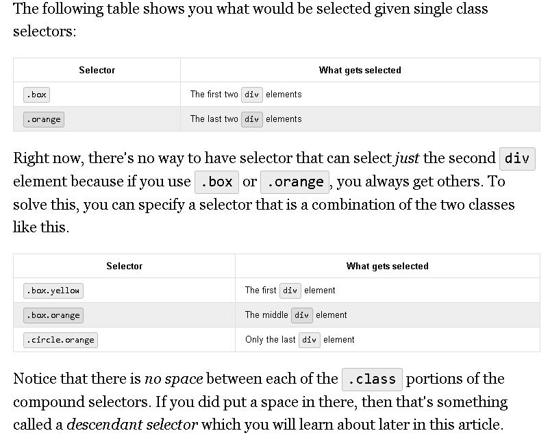

* A [CSS selector](https://developer.mozilla.org/en-US/docs/Glossary/CSS_Selector) applies styles to a specific DOM element or elements. A selector can be any of the following basic types:

*   **Type selectors** -- matches elements by node name (e.g. `div`, `li`, `a`, `p`)
*   **Class selectors** -- matches elements by class name (e.g. `<button class="active">`)
*   **ID selectors** -- matches elements by ID name (e.g. `
`)
*   **Universal selectors** -- matches elements of any type (e.g. `*`)
*   **[Attribute selectors](https://developer.mozilla.org/en-US/docs/Web/CSS/Attribute_selectors)** -- matches elements based on the presence or value of a given attribute (e.g. `a[title]` matches all `a` elements with a `title` attribute)

js is imperative programming language 
css id declaritive meaning there is no control flow... it exicutes top to bottom
inside of decleration box there are properties and values 
type selector looks at html tag-type ...i.e. body tage ---->could apply font family ariel
