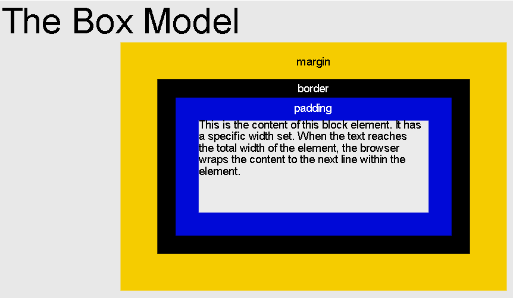
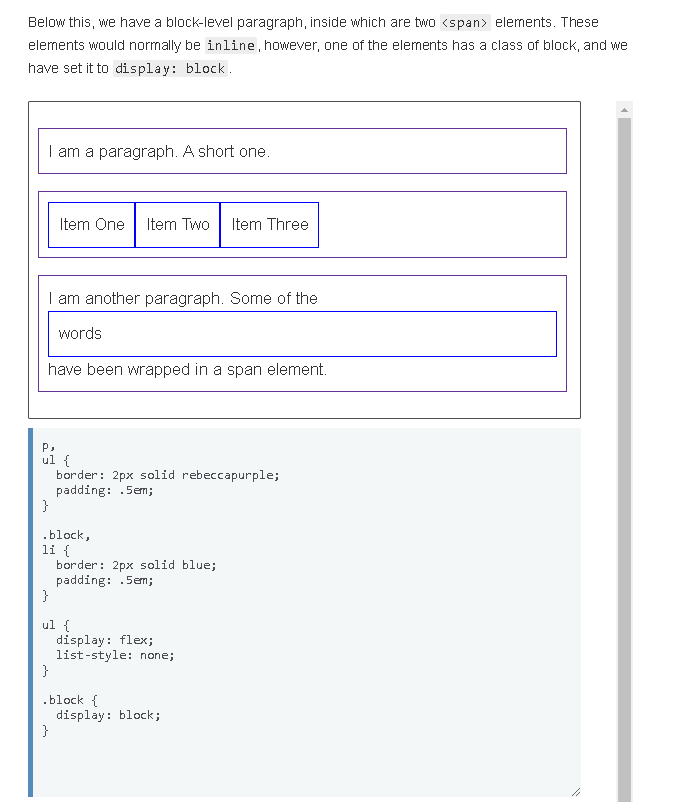
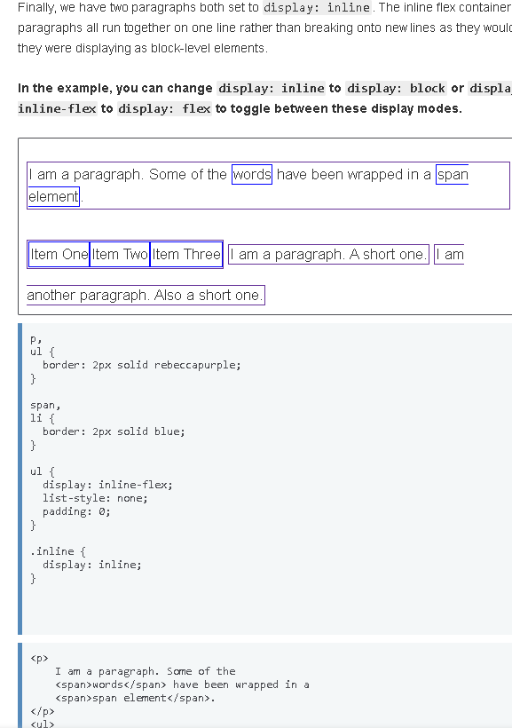
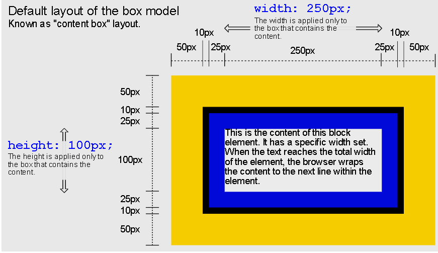
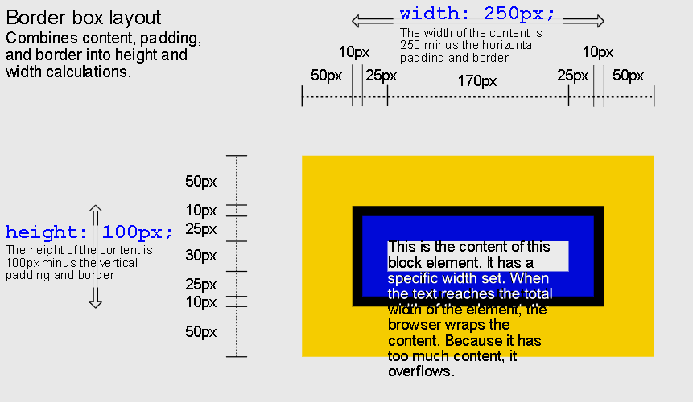
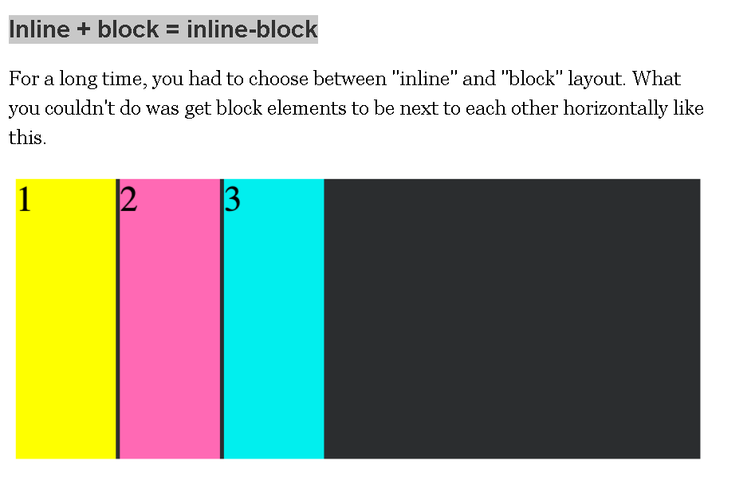

The CSS Box Model is a concept that basically boils down to:
#### --> every DOM element has a box around it. 
The diagram below shows The Box Model with content in the innermost layer, padding wrapped around it,
a border wrapped around the padding, 
and margin as the outermost layer.

can change the size of the content with the CSS width and height properties
 We can add or remove padding with the padding property, set the border with the border property, and add or remove the margin with the margin property.

In CSS we broadly have two types of boxes — block boxes and inline boxes.
These characteristics refer to how the box behaves in terms of page flow, and in relation to other boxes on the page:

If a box is defined as a block, it will behave in the following ways:

* The box will break onto a new line.
* The box will extend in the inline direction to fill the space available in its container. 
    - In most cases this means that the box will become as wide as its container, filling up 100% of the space available.
* The width and height properties are respected.
* Padding, margin and border will cause other elements to be pushed away from the box
* Unless we decide to change the display type to inline, elements such as headings (e.g. <h1>) and 
 all use block as their outer display type by default.

If a box has an outer display type of inline, then:

* The box will not break onto a new line.
* The width and height properties will not apply.
* Vertical padding, margins, and borders will apply but will not cause other inline boxes to move away from the box.
* Horizontal padding, margins, and borders will apply and will cause other inline boxes to move away from the box.
* The <a> element, used for links, , <em> and <strong> are all examples of elements that will display inline by default.

The type of box applied to an element is defined by display property values such as block and inline, and relates to the outer value of display.

Elements
The following is a complete list of all HTML "block-level" elements (although "block-level" is not technically defined for elements that are new in HTML5).

<address>
Contact information.
<article>
Article content.
<aside>
Aside content.
<blockquote>
Long ("block") quotation.

Disclosure widget.
<dialog>
Dialog box.
<dd>
Describes a term in a description list.

Document division.
<dl>
Description list.
<dt>
Description list term.
<fieldset>
Field set label.
<figcaption>
Figure caption.
<figure>
Groups media content with a caption (see <figcaption>).
<footer>
Section or page footer.
<form>
Input form.
<h1>, <h2>, <h3>, <h4>, <h5>, <h6>
Heading levels 1-6.
<header>
Section or page header.
<hgroup>
Groups header information.

Horizontal rule (dividing line).
<li>
List item.
<main>
Contains the central content unique to this document.
<nav>
Contains navigation links.
<ol>
Ordered list.

Paragraph.
<pre>
Preformatted text.
<section>
Section of a web page.
<table>
Table.
<ul>
Unordered list.

List of "inline" elements
The following elements are inline by default (although block and inline elements are no longer defined in HTML 5, use content categories instead):

<a>
<abbr>
<acronym>
<audio> (if it has visible controls)
<b>
<bdi>
<bdo>
<big>
 
<button>
<canvas>
<cite>
<code>
<data>
<datalist>
<del>
<dfn>
<em>
<embed>
<i>
<iframe>

<input>
<ins>
<kbd>
<label>
<map>
<mark>
<meter>
<noscript>
<object>
<output>
<picture>
<progress>
<q>
<ruby>
<s>
<samp>
<script>
<select>
<slot>
<small>

<strong>

<svg>
<template>
<textarea>
<time>
<u>
<tt>
<var>
<video>
<wbr>

###  Standard Box Model vs. border-box

- In the standard Box Model, the width and height of an element set with CSS refers to the width and height of the box's content.
-  Any padding, border and margin added to the element will get added to the total size of actual box. 
- If padding, border or margin are removed from a box, the box size decreases, but the width and height of the content stays the same.

In CSS version 3, the box-sizing property was added to the CSS specification 
- which allows you to set it to the values "content-box" (which is how it is by default) 
- or "border-box", which does what most Web developers want
Setting the box-sizing property to border-box includes
 * the width of the left border, 
 * right border, 
 * left padding,
 * and right padding in the overall width, 
 * and the top border, bottom border,
 * top padding,
  * and bottom padding in the overall calculation of the height.

#### Inline + block = inline-block

"inline-block". This combined the best of both the "inline" and "block" settings:

* Elements would still get laid out left to right
* The layout would take into account their specified width and height properties

Padding
Padding is a CSS property that applies padding on every side of a box. 
This property is a shorthand for padding-top, padding-right, padding-bottom, and padding-left (in clockwise order).

An element can inherit padding from its container, or you can use unset to clear the previously set padding.

Padding is wrapped around content and closely tied to it. 
If you set an element's background-color or background-image in CSS, 
that color or image will be applied to the area that ,
#### includes both content and padding.

