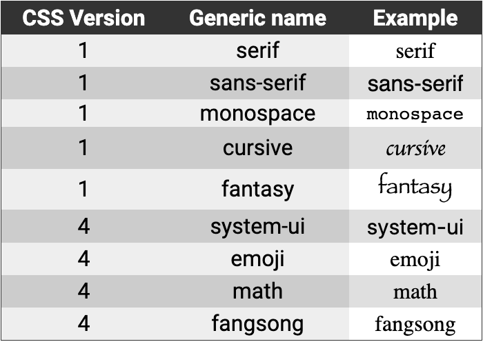
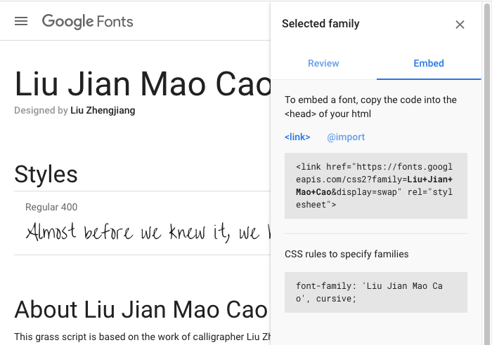
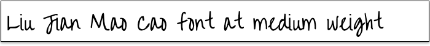
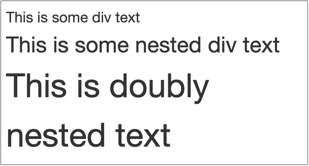
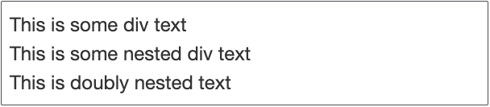

# CSS: Type, Properties And Imports

________________________________________________________________________________
<!-- @import "[TOC]" {cmd="toc" depthFrom=2 depthTo=6 orderedList=false} -->

<!-- code_chunk_output -->

- [Typography](#typography)
- [Font-family](#font-family)
  - [Fonts across the Internet](#fonts-across-the-internet)
- [Font size](#font-size)
  - [Absolute units](#absolute-units)
  - [Relative units](#relative-units)
    - [An example of em](#an-example-of-em)
    - [An example of rem](#an-example-of-rem)
- [Font style for italics](#font-style-for-italics)
- [Font weight for bold](#font-weight-for-bold)
- [Aligning your text](#aligning-your-text)
- [Decorating your text](#decorating-your-text)
- [Casing your text](#casing-your-text)
- [Background images](#background-images)
- [What you've learned](#what-youve-learned)

<!-- /code_chunk_output -->
________________________________________________________________________________

There are a lot of different properties of HTML elements that you can set with
Cascading Style Sheets (CSS). This article introduces you to the common
properties used to style text and elements on a page. Further lessons will show
you more properties to do even more fancy things.

There is technically a difference between the term "typeface" and "font". You
may have never even heard the word "typeface" before. The difference between
"typeface" and "font" really only interests those people that design type faces
and those people that really like to correct other people about arcane and silly
things. This course will treat the terms interchangeably.


All of this terminology goes back to the days of the printing press, when they
used printing presses with "type blocks", wood or lead blocks that had the
reversed image of a letter on it. They'd roll ink onto the raised letters and,
then, press them against paper to get the words on the page. This is why it's
called a "printing press", of course!

## Typography

The World Wide Web is primarily a text-based medium. It is important, then, that
you can use the CSS properties that relate to the text that you see on the
screen. When the browser draws the text on the screen for you to read, it uses a
combination of properties to determine how to render that text. That combination
is literally "the font" that will be used for showing you the text.

In this section, you will learn about the following properties that control how
fonts are selected to use so that text gets rendered to the screen.

* `font-family`
* `font-size`
* `font-style`
* `font-weight`

You'll also learn about a couple of properties that affect how the text is drawn
to the screen.

* `text-align`
* `text-decoration`
* `text-transform`

You will also get introduced to the `@import` statement because that's how you
can include other CSS files. It's particularly important because Google offers
a free service that allows you to select different fonts to include in your
Web page to add some _zing!_ to it.

## Font-family

By default, your browser is going to choose a standard (and probably ugly) font
family for your Web page.

When you use the `font-family` property, you are instructing the browser to use
a specific family of type. For example, you may put something like this into
your CSS for your Web page.

```css
font-family: 'Times New Roman';
```

That means that you would like the browser to use the family of fonts named
_Times New Roman_ as part of figuring out what that should mean. The browser
will then supply defaults for the other aspects of the font (size, weight, etc.)
and show the text affected by the rule.

```css
font-family: 'Helvetica Neue', 'Helvetica', sans-serif;
```

That means that it should apply the font named "Helvetica Neue". If that doesn't
exist on the system (because it's not macOS or doesn't have an Adobe product on
it), then try to use "Helvetica". Most Windows computers have "Helvetica". Now,
if the computer doesn't have "Helvetica Neue" nor does it have "Helvetica", then
it should fall back to the default system "sans-serif" font. "What's that," you
ask....

Besides named fonts like "Times New Roman", "Comic Sans", and "Helvetica", the
most recent CSS specification defines eight generic names that you can use that
will rely on each browser and the OS that it's running on. Here is a table that
contains each of those eight names and the example rendering in Chrome on macOS
for that generic name. (You'll note that the "emoji", "math", and "fangsong"
generic names don't do anything.)



A _serif font_ is a font that has [serifs], those little widenings at the ends
of letters.

A _sans-serif font_ is a font that doesn't have serifs. In Latin _sans_ means
without. The original typesetters in Western Europe who invented this lingo were
all learned in Latin, the smarty-pants language of the day.

A _monospace_ font is one where every letter and symbol has the same width.
These are often called "typewriter fonts", too.

The _cursive_ and _fanatasy_ fonts are novelty fonts that don't get a lot of use
due to the widely different looks between browsers and OSes. Speaking of OSes...

### Fonts across the Internet

It's really important for you to know this following nugget: _not all computers
have the same fonts on them_. That means, if you want to use some fancy font
that you have installed on your computer that other people don't have, then the
folks that don't have that font will see the default _serif_ font instead. This
was especially prevalent a long time ago when Windows and Mac OS had very
different installed fonts. It was nearly impossible to make text look consistent
across browsing experiences. In 1998, the CSS Working Group introduced a new
feature of CSS, the `@font-face` directive that would allow a browser to import
fonts from files hosted on the Internet. But, it wasn't until 2008 that Apple
Safari and Mozilla Firefox actually implemented the feature. All of sudden, Web
designers were free to include stylized fonts on their Web pages that _everyone_
could properly see!

In most cases, you won't use `@font-face` yourself. Instead, you'll use one of
the font-hosting services on the Internet or use the ones that your company has
purchased. That's right, purchased! Many fonts are commercial which means you
buy them for specific types of uses, be it for Web or print, commercial or
personal. But, many people use Google Fonts which are free to use. However,
Google tracks the use of each font across the Internet by putting cookies on
people's devices. If you are privacy-oriented, you will _not_ want to subject
your Web application users to that invasion.

But, let's say you don't care! Let's say you want a fancy hand-written looking
font for your Web page. If you go to [Google Fonts] and search for "liu jian mao
cao". When you click on the search result, you will be taken to its page.



When you click the "+ Select this style" link, it will show you a review panel.
You can click on the "Embed" header and, then, the "@import" link. That's the
information that you want so you can add it to your Web page. At the top of
your CSS file, you need to put the `@import` line from the example.

```css
@import url('https://fonts.googleapis.com/css2?family=Liu+Jian+Mao+Cao&display=swap');
```

Now you can use it to change the font family for any element on your page by
following the second part of the embedding instructions. Here's an example of
some text that has the ".liu-jian-mao-cao" class applied to its surrounding
element and the CSS property/value to set it to the font.

```css
.liu-jian-mao-cao {
  font-family: 'Liu Jian Mao Cao', cursive;
}
```



## Font size

Now that you can change the family of the font, the next important aspect to
control is the size of the text begin rendered. You do this with the `font-size`
property in CSS. That's the easy part. The hard part is the _unit of
measurement_ you use with the size. CSS has two kinds of units: absolute and
relative.

In either case, the syntax for using these measurements is `(number)(unit of
measure)`. That means if you wanted something to be one centimeter in your Web
page, you would choose what property you want it to apply to and use the value
"1cm". If you want to set the size of your font to one centimeter, you would use
the property value combination like this:

```css
font-size: 1cm;
```

**Please note** that there is _no space_ between the value (1) and the unit of
measure (cm). Putting a space between the value and the unit of measure will
_cause the property to not get applied_! This is a source of many Web
developers' mistakes. Take care when you type your CSS.

### Absolute units

The absolute units are measured in pixels or inches or centimeters, the latter
two making _no sense_ on a Galaxy Note smartphone. You will see two absolute
units most of the time in CSS out in production, one being far more popular than
the other.

| Unit | Name   | Equivalent to           |
|------|--------|-------------------------|
| pt   | Points | 1pt = 1/72nd of an inch |
| px   | Pixels | 1px = 1/96th of an inch |

Back in the 1990s and early 2000s, the "pt" unit was still used quite a bit. By
the mid-2000s, it had fallen out of favor. Most of the time, you will likely
only see "px" which makes sense because pixels are how the dimensions of your
screen that you're looking at are measured.

### Relative units

You will also see only two relative units most of the time in CSS out in
production.

| Unit | Relative to                             |
|------|-----------------------------------------|
| em   | The font size of the containing element |
| rem  | The font size of the root element       |

#### An example of em

Say you had the following HTML.

```html
<style>
  html {
    font-size: 8px;
  }
  div {
    font-size: 1.5em;
  }
</style>
<div id="outer">
  This is some div text
  <div id="nested">
    This is some nested div text
    <div id="doubly-nested">
      This is doubly nested text
    </div>
  </div>
</div>
```

When that renders, the browser gets to the first `div` (that is, `#outer`) and
says to itself, "Hey! This needs to be `1.5em`, that is, 1.5 times the size of
the font that it would normally be. The browser checks and notices that it would
normally be "8px" tall (as specified by the CSS rule for the `html` element).
Therefore, it calculates that the text for that needs to be `1.5 * 8px = 12px`.
The text "This is some div text" gets drawn at 12 pixels tall.

Then, it gets to `#nested` which is a `div`. The browser says, "Hey! this needs
to be `1.5em`, that is, 1.5 times the size of the font that it would normally
be." Right now, the browser is drawing its text at `12px` from the previous
calculation (it's still in `#outer`), so it calculates a new font size of `1.5 *
12px = 18px`. The text "This is some nested div text" gets drawn 18 pixels tall.

Finally, it gets to the inner-most `div`, `#doubly-nested`. It does the same
calculation as before, multiplying 1.5 by the size that it's currently drawing
text. That's 18 pixels, right now. Thus, the text "This is doubly nested text"
gets drawn at `1.5 * 18px = 27px` tall.



#### An example of rem

Say you had the same HTML with one vital difference: the `1.5em` from the
previous example is changed to `1.5rem`.

```html
<style>
  html {
    font-size: 8px;
  }
  div {
    /* Here's the change */
    font-size: 1.5rem;
  }
</style>
<div id="outer">
  This is some div text
  <div id="nested">
    This is some nested div text
    <div id="doubly-nested">
      This is doubly nested text
    </div>
  </div>
</div>
```

Now, every time the browser gets to a `div`, it asks itself, "What is 1.5 times
the root element's font size?" That answer is the same, every time, because the
root element's font size doesn't change. It's just `8px` set right there in the
`html` rule. So, it doesn't matter that the `div` elements are nested; all of
the text just gets drawn at `1.5 * 8px = 12px`.



## Font style for italics

The `font-style` property is the setting that you'll use if you want to have
some of your text in italics. You will see in a lot of HTML that developers will
use the outdated `i` element or the `em` element, which is meant for _emphasis_.
That matters to screen readers. Here's an example of how to use `font-style`.

```html
<style>.book-title { font-style: italic; }</style>
<p>
  There is a funny movie named <span class="book-title">Frequently Asked
  Questions About Time Travel</span> with some good laughs in it.
</p>
```

## Font weight for bold

The `font-weight` property is the setting that you'll use if you want to have
some of your text in bold. You will see in a lot of HTML that developers will
use the outdated `b` element or the `strong` element, which is meant for
**strong text**, another type of emphasis that matters to screen readers.

You can use keyword values for `font-weight`: `normal` and `bold`.

You can use relative values for `font-weight`: `lighter` and `bolder`.

You can use even hundred numeric values from 100 - 900. The value of 400 is
equivalent to `normal` and the value of 700 is equivalent to `bold`.

Here's an example of how to use `font-weight`.

```html
<style>
  .bold { font-weight: bold; }
  .also-bold { font-weight: 700; }
</style>
<p class="bold">This looks bold.</p>
<p class="also-bold">This looks bold.</p>
```

## Aligning your text

There are four ways that you can align your text in an element. If you've ever
used a word processor like [LibreOffice Writer] or Google Docs, then you
probably have used the "left", "center", and "right" alignments available to you
in those programs. You just set them on the element that you want to affect the
layout of the text.

In the following table, all of the `th` and `td` elements have `text-align:
center` set on them.


There's one more, "justify", that makes the words align to the left and right
like you see in some books by adjusting the spaces between the words. The
inconsistent spacing between words created by justified text can be problematic
for people with cognitive concerns such as Dyslexia. The Web Content
Accessibility Guidelines expressly forbid this setting.

## Decorating your text

With the `text-decoration` property, you can put lines above, through, and under
text. The lines can be solid, dashed, or wavy! By default, links on a Web page
have an underline. That underline comes from this property.

```css
/* Default browser setting */
a {
  text-decoration: underline currentcolor;
}
```

Now that you know about it, you could change it, if you want. Read the short
[reference for `text-decoration`] on MDN.

## Casing your text

Sometimes you want some text to be all upper case, lower case, or title case
(that is, with all words capitalized). You can use `text-transform` to do this.

```html
<style>
  .loud { text-transform: uppercase; }
  .soft { text-transform: lowercase; }
  .title { text-transform: capitalize; }
</style>
<p class="loud">THE WIND blows across the sea.</p>
<p class="soft">THE WIND blows across the sea.</p>
<p class="title">THE WIND blows across the sea.</p>
```


You can see that the "uppercase" setting forces all text to be capital letters,
the "lowercase" setting forces all text to be lowercase letters, and the
"capitalize" setting forces the first letter of every word to be capitalized but
leaves the rest alone.

## Background images

One of the fanciest things you can do is set the background image for an
element. The reason that you'd do this rather than including an `img` element in
your page is that you can "clip" the image however you want.

To specify a background image for an element, you set the `background-image`
property to a URL using the CSS `url()` function.

Then, to set the size of the background image so that it "best" covers the
element, you set the `background-size` property to "cover". To put that
together, if you want to see the App Academy logo on a page in a 100 pixel by
100 pixel `div` with an id of "aa-logo", then you would write the following CSS
to do that.

```css
#aa-logo {
  background-color: white;
  background-image: url(https://appacademy.github.io/styleguide/assets/logo/logo-emblem-black-1000.png);
  background-size: cover;
  height: 100px;
  width: 100px;
}
```

Here's the [Background Image of an Element] CodePen for you to play around with
that shows the above CSS. Try changing the width and height of the `#aa-logo` to
see how the "cover" setting behaves with the square App Academy Logo image.

## What you've learned

These are the fundamentals of making readable Web pages! Wow, that's some great
information. With all of that, you can now speak and act confidently about type
faces, sizes, styles, and weights. You know some of the generic names that
browsers support for font families. You can also adjust the alignment of the
text on your Web pages, as well as affect that its capitalization through
transformation. You also learned about how to use Web fonts through the use of
the `@import` statement from a hosting facility like Google Fonts. Finally, you
learned about four kinds of measures for fonts in this: "pt", "px", "em", and
"rem".


[Google Fonts]: https://fonts.google.com
[LibreOffice Writer]: https://www.libreoffice.org/discover/writer/
[serifs]: https://en.wikipedia.org/wiki/Serif
[Background Image of an Element]: https://codepen.io/aa-academics/pen/rNVZJeb?editors=1100
[reference for `text-decoration`]: https://developer.mozilla.org/en-US/docs/Web/CSS/text-decoration
