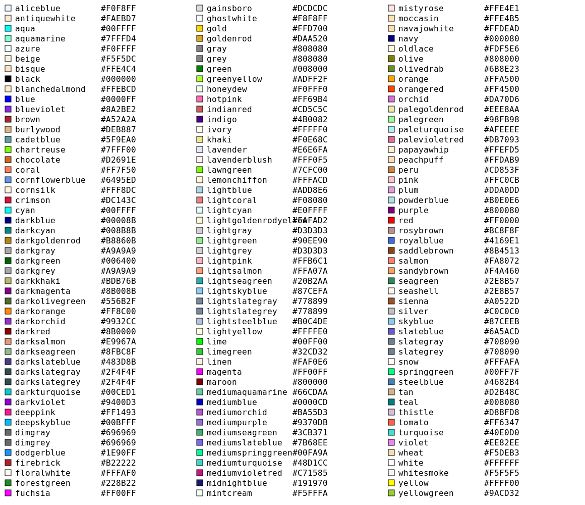
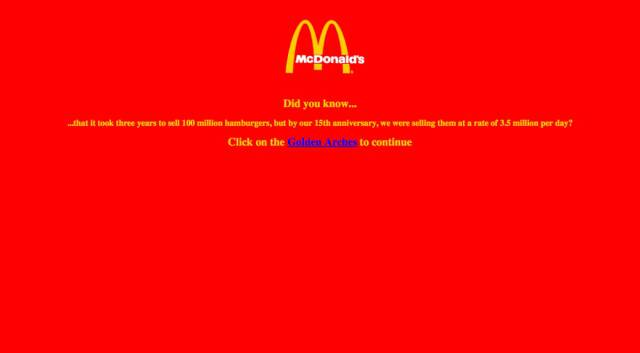

# CSS: Colors, Borders, and Shadows
________________________________________________________________________________
<!-- @import "[TOC]" {cmd="toc" depthFrom=2 depthTo=6 orderedList=false} -->

<!-- code_chunk_output -->

- [Colors](#colors)
  - [Specifying by name](#specifying-by-name)
  - [Specifying by RGB](#specifying-by-rgb)
  - [The alpha channel](#the-alpha-channel)
- [Applying colors](#applying-colors)
- [Borders](#borders)
- [Shadows](#shadows)
- [Opacity](#opacity)
- [What you've learned](#what-youve-learned)

<!-- /code_chunk_output -->
________________________________________________________________________________

A Web page that just has black text on a white background is pretty boring. It
makes sense that some of the earliest features that allowed you to customize
the style of a Web page had to do with colors. Once those were firmly in place,
borders, shadows, and transparency came along pretty quickly. In this article,
you'll learn about how to affect these.

## Colors

In CSS you can specify colors in more than one way. This section shows you how
to do the three most popular ways: by their name, by their hexadecimal RGB
value, and by their decimal RGB value.

### Specifying by name

The least powerful way is to specify a specific [name of a color]. That link
takes you to a table that shows you the colors and the breakdown of each into
the values that you can use with the other ways to specify colors. Here's an
image that shows them all to you, too.



### Specifying by RGB

In color theory, there is the idea of a color wheel. The colors red, green, and
blue comprise three pigments from which other colors can be made by mixing
together different values of red, green, and blue. In the following color wheel,
you can see that using red, blue, and green as the primary colors, then magenta,
yellow, and cyan are the secondary colors, and rose, violet, azure, spring
green, chartreuse green, and orange are tertiary colors.


The way that we specify the levels of each of those three colors, red, blue, and
green, are by using the values between 0 and 255 where 0 means _none_ and 255
means _as much as possible_. The following table shows some values for common
colors using the mixture of the three colors. Each column has the decimal value
and its two-digit hexadecimal representation.

| Red value  | Green value | Blue value | Result      |
|------------|-------------|------------|-------------|
| 255   (FF) | 0     (00)  | 0     (00) | Red         |
| 0     (00) | 255   (FF)  | 0     (00) | Green       |
| 0     (00) | 0     (00)  | 255   (FF) | Blue        |
| 255   (FF) | 0     (00)  | 255   (FF) | Magenta     |
| 0     (00) | 255   (FF)  | 255   (FF) | Yellow      |
| 0     (00) | 0     (00)  | 0     (00) | Black       |
| 255   (FF) | 255   (FF)  | 255   (FF) | White       |
| 190   (BE) | 190   (BE)  | 190   (BE) | Gray        |
| 148   (94) | 0     (00)  | 211   (D3) | Dark Violet |

To use these numbers in CSS, you can use these decimal variations with the
`rgb()` function. Or, you can convert them all to hexadecimals, concatenate them
together, and use that. For historical reasons, that is the most popular way,
even though it seems silly.

To specify the color dark violet, you could supply the three decimal color
values like this `rgb(148, 0, 211)` or the concatenated, two-digit hexadecimal
numbers like this, preceded by a hash symbol like this `#9400D3`.

### The alpha channel

You can change the transparency of a color by specifying its _alpha channel_
value. Presently, you can only do this with the `rgba()` function which is just
like the `rgb()` function, but takes a fourth parameter, the alpha channel
value. That value is between 0.0 and 1.0, inclusive. If you specify 0.0, that is
a totally transparent color. If you specify 1.0, that is a totally solid color.
If you specify 0.5, that is a half-transparent color.

## Applying colors

The first two ways that you can apply colors are to _text_ and to the
_background_ of elements. The associated CSS properties for each of those are in
the following table.

| To affect the...               | use the property... |
|--------------------------------|---------------------|
| color of text                  | `color`             |
| background color of an element | `background-color`  |

I know. Why isn't it named "text-color"? «shrug» It sure would be more
consistent. But, that's what is there.

So, to make unreadable text, you might use

```css
/* Try to decode the colors from */
/* the color table above         */
body {
  background-color: rgb(255, 0, 0);
  color: #00FFFF;
}
```

especially if you were a purveyor of substandard hamburgers.



## Borders

To specify a border for an element, you use the `border` property and three
values separated by spaces:

1. The width of the border line (using length units of measurement like `px`)
2. The style of the line, being one of:
   * solid - used almost all of the time
   * dotted - used some times
   * dashed - infrequently used
   * double - infrequently used
   * groove - infrequently used
   * ridge - infrequently used
   * inset - infrequently used
   * outset - infrequently used
3. The color of the border using one of the methods previously discussed

So, to specify a border around an HTML element that is 4px thick, solid, and
green, you would write

```css
.highlighted {
  border: 4px solid green;
}

/* or */
.highlighted {
  border: 4px solid rgb(0, 255, 0);
}

/* or */
.highlighted {
  border: 4px solid #00FF00;
}
```

You also target specific borders of an element by appending a dash and the
location of the border: top, right, bottom, or left. For example, a common way
to make text look underlined is to use

```css
.underlined {
  border-bottom: 1px solid black;
}
```

## Shadows

There are two kinds of shadows in CSS, _box shadows_ and _text shadows_. The
box shadows apply to HTML elements. Text shadows apply to text.

To specify box shadows, you use the `box-shadow` property and specify one of the
following:

* The word "none" if you want no shadow
* Two lengths and a color
* Three lengths and a color
* Four lengths and a color

The first two lengths are the horizontal and vertical offsets of the shadow.

The third length, if provided, is the blur radius of the shadow. The bigger this
number, the bigger the blur, so the bigger the shadow.

The fourth length, if provided, is the spread radius. Positive values make the
shadow expand. Negative values make it shrink.

The color is usually some transparent value of black, like `rgba(0, 0, 0, 0.4)`.

Open up this CodePen that shows you an interactive example of [different
applications of the box-shadow property]. You can play around with the values to
see how they affect the different shadows.

Text shadows work similarly, but the format is more lenient. You can specify the
text shadow using:

* A color, the horizontal offset, and the vertical offset
* A color, the horizontal offset, the vertical offset, and the blur radius
* The horizontal offset, the vertical offset, and a color
* The horizontal offset, the vertical offset, the blur radius, and a color

That applies shadows to text.

## Opacity

You saw that you can affect the transparency of a color by using its alpha
channel. You can do the same thing with entire elements, causing them to be
see-through using the `opacity` property. Just like the alpha channel, it takes
a value from 0.0 to 1.0, inclusive, with 0.0 totally transparent and 1.0 being
completely opaque (solid).

Open up this CodePen that shows you [different applications of the opacity
property]. You can play around with the different values of the `opacity`
property to see how it affects the element.

## What you've learned

In this article you learned all about colors, opacity, borders, and shadows.
You should now be able to style content on an HTML page using colors as names,
hexadecimal RGB values, decimal RGB values, and decimal RGB values with an
alpha channel. You can use those colors, then, to customize borders and shadows.
Finally, you learned how to affect the entire transparency of an element using
its `opacity` property.

[name of a color]: https://en.wikipedia.org/wiki/X11_color_names#Color_name_chart
[different applications of the box-shadow property]: https://codepen.io/aa-academics/pen/GRJXjdZ?editors=0100
[different applications of the opacity property]: https://codepen.io/aa-academics/pen/zYGJKMe?editors=0100
