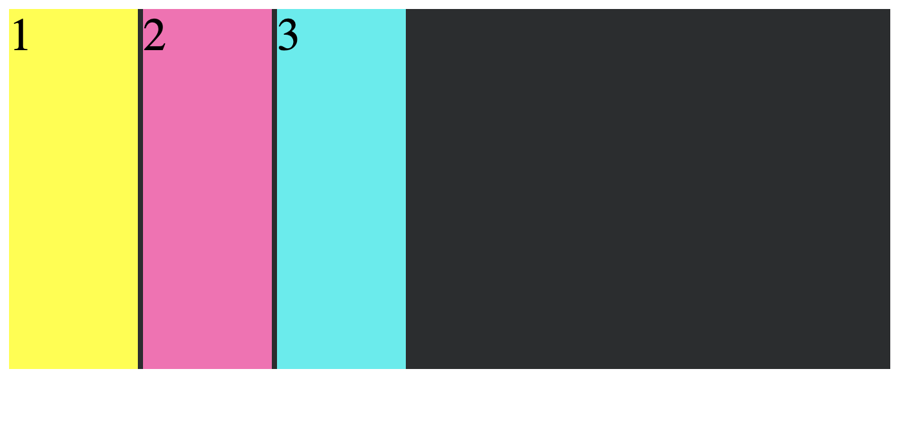

# Layout: The Box Model
________________________________________________________________________________
<!-- @import "[TOC]" {cmd="toc" depthFrom=2 depthTo=6 orderedList=false} -->

<!-- code_chunk_output -->

- [The Box Model](#the-box-model)
  - [Default box settings](#default-box-settings)
  - [Standard Box Model vs. border-box](#standard-box-model-vs-border-box)
  - [Inline + block = inline-block](#inline-block-inline-block)
- [Padding](#padding)
- [Border](#border)
  - [Properties within the shorthand](#properties-within-the-shorthand)
- [Margin](#margin)
  - [Centering an element with margin](#centering-an-element-with-margin)
- [What you learned:](#what-you-learned)

<!-- /code_chunk_output -->
________________________________________________________________________________

Understanding how to utilize margin, border, and padding around page elements
is an essential part of designing/developing for the Web.

In this reading, we’ll go over “The Box Model” and how to use the CSS
properties `margin`, `border` and `padding` on elements to create/enhance the
page layout.

## The Box Model

The CSS Box Model is a concept that basically boils down to every DOM element
has a box around it. The diagram below shows The Box Model with content in the
innermost layer, padding wrapped around it, a border wrapped around the padding,
and margin as the outermost layer.


You can think of each box as a gift wrapped inside a few different layers.
Consider receiving a shiny new computer as a gift. Inside the box is the actual
computer (the _content_), which is wrapped in protective foam (the _padding_).
Outside of the foam is the cardboard box (the _border_), and outside of the box
is a fancy wrapping paper with glittery gold pineapples on it (the _margin_) cuz
_festive_!

We can change the size of the content with the CSS `width` and `height`
properties. We can add or remove padding with the `padding` property, set the
border with the `border` property, and add or remove the margin with the
`margin` property.

### Default box settings

According to [MDN][1], we know certain things about each box based on whether
the boxed element is displayed as a block or inline.

With elements (boxes) that have a `display` value of "block", either because it
is the default value for that kind of element (i.e., `div` elements, headers,
and `p` elements) or it is specifically overridden in the CSS, the browser
follows these rules to layout the element:

* The box fills available container space, and in most cases it fills up 100%
of the available space, becoming as wide as its container.
* Each new box appears on a new line/row.
* The CSS properties `width` and `height` are respected.
* The `padding`, `margin` and `border` of the box will push other elements
farther away from the box.

With elements (boxes) that have a `display` value of "inline", either because it
is the default value for that kind of element (i.e., `span`, `a`, and `img`
elements) or it is specifically overridden in the CSS, the browser follows these
rules to layout the element:

* Each box appears next to each other in a single line until it fills up the
available space.
* The CSS properties `width` and `height` don’t apply.
* The `padding`, `margin` and `border` of a box are applied, but they don’t
push other inline boxes away from the box.

The knowledge of which elements are inline and which are block, by default, is
important knowledge as you craft appealing and maintainable Web pages. As such,
you should refer to [MDN's list of inline elements][5] and [MDN's list of block
elements][6] to know which does what.

### Standard Box Model vs. border-box

In the standard Box Model, the `width` and `height` of an element set with CSS
refers to the width and height of the box’s _content_. Any `padding`,
`border` and `margin` added to the element will get added to the total size of
actual box. If `padding`, `border` or `margin` are removed from a box, the box
size decreases, but the `width` and `height` of the content stays the same.

```css
.box {
  border:  10px solid black; /* Applies to all four sides. */
  height:  100px; /* Content's height */
  margin:  50px;  /* Applies to all four sides. */
  padding: 25px;  /* Applies to all four sides. */
  width:   250px; /* Content's width */
}
```


This way of calculating width and height bothered many programmers. They wanted
to set the width and height of an element to _include_ the padding and border
because that just makes more sense than the other way. In CSS version 3, the
`box-sizing` property was added to the CSS specification which allows you to set
it to the values "content-box" (which is how it is by default) or "border-box",
which does what most Web developers want. Setting the `box-sizing` property to
`border-box` includes the width of the left border, right border, left padding,
and right padding in the overall `width`, and the top border, bottom border, top
padding, and bottom padding in the overall calculation of the `height`.

```css
.box {
  border:  10px solid black; /* Applies to all four sides. */
  box-sizing: border-box;
  height:  100px; /* Sum of content + top/bottom padding + top/bottom border */
  margin:  50px;  /* Applies to all four sides. */
  padding: 25px;  /* Applies to all four sides. */
  width:   250px; /* Sum of content + left/right padding + left/right border */
}
```


### Inline + block = inline-block

For a long time, you had to choose between "inline" and "block" layout. What you
couldn't do was get block elements to be next to each other horizontally like
this.



Instead, you had to hack around it using the `float` property and hope that it
worked properly.

When the CSS version 2 came out, it introduced a new display property value of
"inline-block". This combined the best of both the "inline" and "block"
settings:

* Elements would still get laid out left to right
* The layout would take into account their specified width and height properties

With "inline-block", you could finally get what looked like columns without
having to resort to the `float` hack.

## Padding

[Padding][2] is a CSS property that applies padding on every side of a box.
This property is a shorthand for `padding-top`, `padding-right`,
`padding-bottom`, and `padding-left` (in clockwise order).

Padding values can be a length (i.e. px, em, rem) or a percentage (%). Here are
some examples:

```css
.box-1 {
  /* One value applies to all four sides. */
  padding: 3em;
}

.box-2 {
  /* Two values: top & bottom | left & right */
  padding: 20% 5%;
}

.box-3 {
  /* Three values: top | left & right | bottom. */
  padding: 15px 10px 20px;
}

.box-4 {
  /* Four values:  top | right | bottom | left*/
  padding: 0 10px 2em 1em;
}

.box-5 {
  /* Global values */
  padding: inherit;  /* OR initial OR unset */
}
```

As previously stated, `padding` is a shorthand value. Thus, the definition above
for the "box-4" class could be declared like this, too.

```css
.box-4 {
  padding-top: 0;
  padding-right: 10px;
  padding-bottom: 2em;
  padding-left: 1em;
}
```

The `initial` or default padding values of most elements are 0.

An element can `inherit` padding from its container, or you can use `unset`
to clear the previously set padding.

Padding is wrapped around content and closely tied to it. If you set an
element’s `background-color` or `background-image` in CSS, that color or image
will be applied to the area that includes both content and padding.

To illustrate the last point, compare an element without padding to one with
padding. This CSS below will result in the following image:

``` css
.box-parent {
  background-color: #000000;  /* Black */
  width: 300px;
  height: 300px;
}

.box-child {
  background-color: #ffff00;  /* Yellow */
  width: 100px;
  height: 280px;
}
```


The above image shows a parent element with a height of `300px` and a child
element with a height of `280px`. Because the yellow child element is shorter
and narrower than the parent element, you can see the black background of the
parent element to the right and beneath the yellow of the child element. But,
what would happen if you added `10px` of padding around the yellow element?

``` css
.box-parent {
  background-color: #000000;  /* Black */
  width: 300px;
  height: 300px;
}

.box-child {
  background-color: #ffff00;  /* Yellow */
  width: 100px;
  height: 280px;
  padding: 10px; /* Applies to all four sides. */
}
```


The yellow child element now has `10px` of padding all the way around it,
resulting in a larger yellow rectangle, increasing in an element that has a
calculated height of `280px + 10px + 10px = 300px`. Because background colors
are applied to the content _and_ the padding, the rectangle now fills 300px of
the vertical space covering the entire parent element's height.

## Border

[Border][3] is a shorthand CSS property that sets an element's border on all
sides. It sets the values of `border-width`, `border-style`, and `border-color`
(in that order).

Here is an example of setting an element’s `border` in CSS:

```css
.box {
  border: 3px solid #000000;
  /* border-width | border-style | border-color */
}
```

The above shorthand is equivalent to the following:

```css
.box {
  border-width: 3px;
  border-style: solid;
  border-color: #000000;
}
```

As part of the Box Model, the 3px `border-width` above gets factored into the
total box size, along with the content, padding and margin. The default
`border-width` is `medium`. The default `border-style` is `none`. The default
`border-color` is the `currentcolor` which will take the value of the color of
the current text, if that color has been explicitly set. Which, is weird. You
probably don't ever want to use that.

### Properties within the shorthand

You can break down each of the three border properties above into further
sub-properties:

* `border-width`:
  * `border-top-width`
  * `border-right-width`
  * `border-bottom-width`
  * `border-left-width`

* `border-style`:
  * `border-top-style`
  * `border-right-style`
  * `border-bottom-style`
  * `border-left-style`

* `border-color`:
  * `border-top-color`
  * `border-right-color`
  * `border-bottom-color`
  * `border-left-color`

Check the MDN document on the [border][3] property for more information about
its properties.

## Margin

[Margin][4] is a shorthand CSS property that sets the margins on every side of
an element. It encompasses `margin-top`, `margin-right`, `margin-bottom`, and
`margin-left`.

Like padding, margin values can be a length (i.e. px, em, rem) or a percentage
(%). It can also take a value of `auto`, which we’ll explain below. Here are
some examples:

```css
.box-1 {
  /* One value applies to all four sides. */
  margin: 10%;
}

.box-2 {
  /* Two values: top & bottom | left & right */
  margin: 0 2em;
}

.box-3 {
  /* Three values: top | left & right | bottom. */
  margin: 30px 0 15px;
}

.box-4 {
  /* Four values:  top | right | bottom | left*/
  margin: 10% 20px 10px 5%;
}

.box-5 {
  /* Global values */
  margin: inherit;  /* OR initial OR unset */
```

### Centering an element with margin

In addition to the margin values above, we can also use a margin value of
`auto`. With the `auto` value, the browser sets the margin for an element. We
can apply this property to horizontally center an element inside its parent
container. The following example CSS will result in a yellow element
horizontally centered inside its container:

``` css
.box-parent {
  background-color: #000000;  /* Black */
  width: 300px;
  height: 300px;
}

.box-child {
  background-color: #ffff00;  /* Yellow */
  width: 100px;
  height: 280px;
  padding: 10px;
  margin: 0 auto;  /* Centers element horizontally. */
}
```


Prior to flexbox and its container property `justify-content`, using `margin: 0
auto` to center elements inside a container was standard practice, and it’s
still used for centering elements on browsers that do not support flexbox (like
older versions of IE).

## What you learned:

* The Box Model and parts of a standard box
* What `box-sizing: border-box` does
* The `padding` property and its sub-properties
* The `border` property and its sub-properties
* The `margin` property and its sub-properties
* Centering elements using the margin value `auto`

[1]: https://developer.mozilla.org/en-US/docs/Learn/CSS/Building_blocks/The_box_model
[2]: https://developer.mozilla.org/en-US/docs/Web/CSS/padding
[3]: https://developer.mozilla.org/en-US/docs/Web/CSS/border
[4]: https://developer.mozilla.org/en-US/docs/Web/CSS/margin
[5]: https://developer.mozilla.org/en-US/docs/Web/HTML/Inline_elements#Elements
[6]: https://developer.mozilla.org/en-US/docs/Web/HTML/Block-level_elements#Elements
