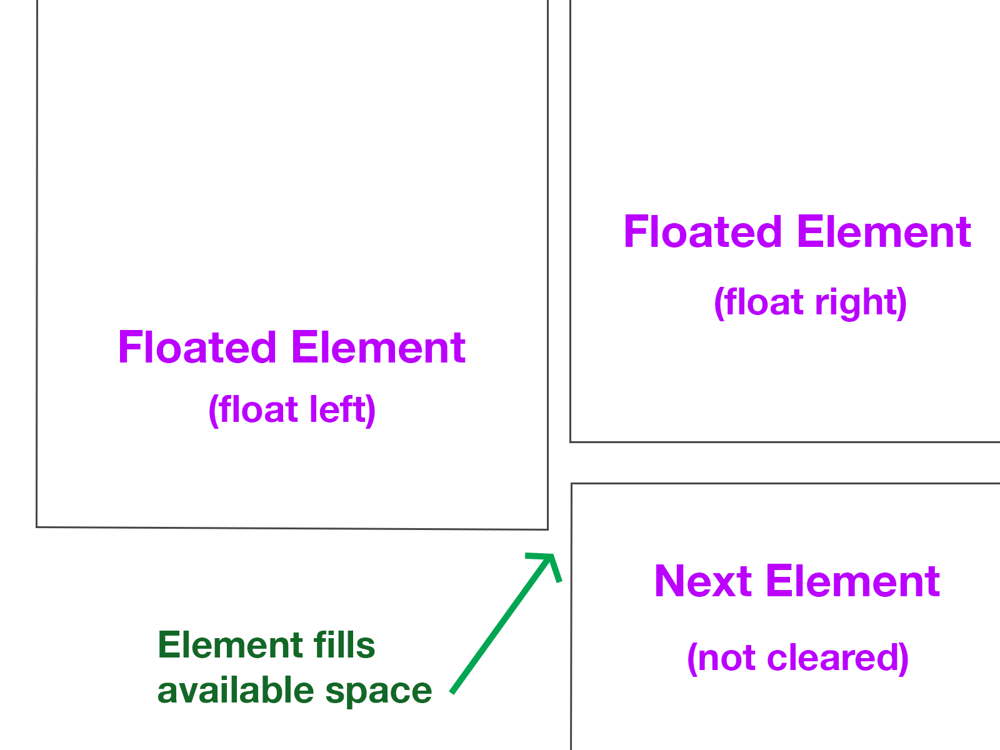
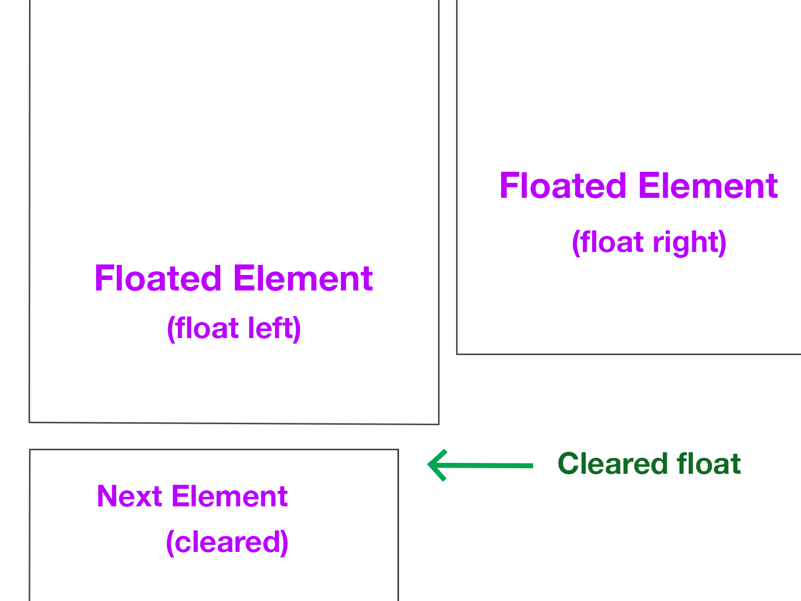
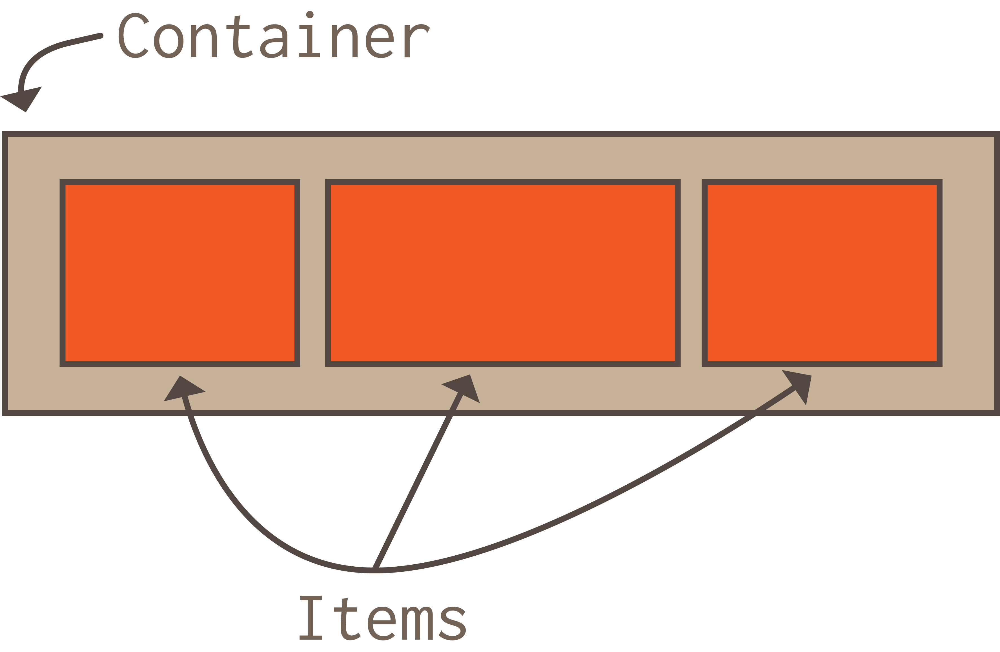
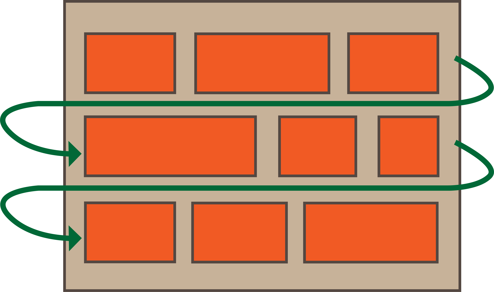
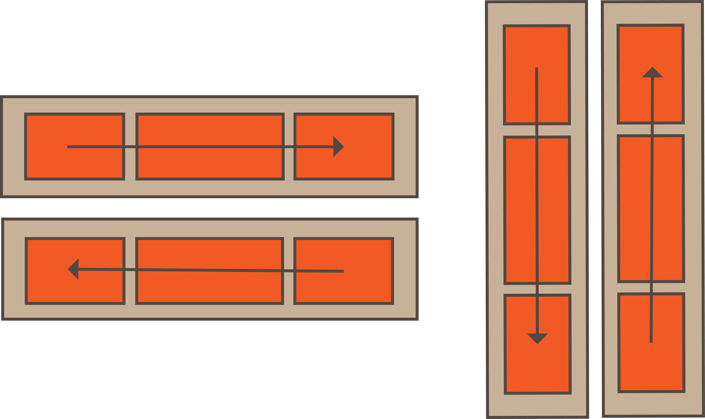

# Flexbox Layout
________________________________________________________________________________
<!-- @import "[TOC]" {cmd="toc" depthFrom=2 depthTo=6 orderedList=false} -->

<!-- code_chunk_output -->

- [Pre-flexbox float](#pre-flexbox-float)
- [Using flexbox](#using-flexbox)
  - [Flex container styles](#flex-container-styles)
  - [Flex items styles](#flex-items-styles)
- [Flexbox froggy](#flexbox-froggy)
  - [What we learned:](#what-we-learned)

<!-- /code_chunk_output -->
________________________________________________________________________________

Flexbox is a CSS module that provides a convenient way for us to display items
inside a _flexible_ container so that the layout is responsive.

With flexbox, a container’s width and height automatically adjust to fit the
viewport, and the sizing, alignment, and spacing of the items inside the
container are optimized for the available space.

## Pre-flexbox float

Back in ye olden pre-flexbox days, developers used a few different CSS
techniques to display/position elements in a container, the most common of
which is [float][1].

Born from the print layout notion of text wrapping around images, the float
property has been widely used to create Web page layouts. The basic idea behind
floated elements is that, like images in a print layout, they are considered
part of the _flow_ of the page. Other elements, like text that wraps, will
_reflow_ around the floated elements.

A tricky and inconvenient issue related to float is the necessity of
_clearing_ the float. This is what happens when floated elements have not been
cleared:



Because other non-floated elements take up the available space around a floated
element, we need to `clear` the float by setting up an empty DIV (i.e. block
element) after it, or by setting up a `.clearfix:after` pseudo selector in CSS.
(Read more about this in this CSS-Tricks doc about [float][1]).



By resizing elements in the container, or parent element, and redistributing
space evenly around elements, flexbox takes care of such issues for us.

## Using flexbox

With flexbox, a container element is automatically resized to fit the viewport
size without needing to use breakpoints. Elements within the container are
resized and distributed to best fill the available space. See the image
below for an example of how elements in a container would be laid out using
flexbox:



The [flexbox layout][2] consists of CSS styles applied to:

* A parent element (i.e. _**flex container**_)
* Its children (i.e. _**flex items**_)

### Flex container styles

To set a parent element to be a flex container, we simply need to apply
`display: flex` to a CSS class selector, like so:

```css
.container {
  display: flex;  /* OR inline-flex */
}
```

By default, flex items will try to fit onto one line. To get elements within
the container to wrap to a new line, we need to add the `flex-wrap` property to
the container:

```css
.container {
  display: flex;
  flex-wrap: wrap;  /* OR nowrap OR wrap-reverse. */
}
```



We can also set the direction of the main axis using `flex-direction`. This
allows us to create either _rows_ or _columns_ of elements:

```css
.container {
  display: flex;
  flex-wrap: wrap;
  flex-direction: row;  /* OR row-reverse OR column OR column-reverse */
}
```



We can combine both `flex-direction` and `flex-wrap` with a single property
called `flex-flow`:

```css
.container {
  display: flex;
  flex-flow: row wrap;  /* Use the flex-direction first, followed by the flex-wrap. */
}
```

Additional properties we can set on the flexbox container include:

* `justify-content` -- Defines the alignment of flex items along the main axis
  and distributes extra container space around/between items.
* `align-items` -- Like justify-content for the cross axis (e.g. items aligned
on the Y axis, instead of the X axis).
* `align-content` -- Redistributes extra space on the cross axis.

### Flex items styles

We are not required to put styles on the flex items, but we may choose to do so
for additional customization.

By default, flex items appear in the order they are added to the DOM (i.e. the
order they are listed in an HTML file). However, we can use the `order`
property to change their order in the flex container.

```css
.item-1 {
  order: 1;  /* Must be an integer. Default is 0. */
}
.item-2 {
  order: 2;  /* Must be an integer. Default is 0. */
}
.item-3 {
  order: 3;  /* Must be an integer. Default is 0. */
}
```

Additional properties we can set on flex items include:

* `flex-grow` -- Dictates amount of available space inside the flex container
the item should take up. Must be an integer. Default is 0.
* `flex-shrink` -- Defines the ability for a flex item to shrink if necessary.
Must be an integer. Default is 1.
* `flex-basis` -- The default size of an element before the remaining space is
distributed. It can be a length (e.g. 20%, 5rem, etc.) or a keyword (e.g. auto,
content).
* `flex` -- Shorthand for `flex-grow`, `flex-shrink` and `flex-basis`. Default
is 0 1 auto.
* `align-self` -- Overrides default alignment set by the `align-items` property
on the container.

Check out the CSS-Tricks article [A Complete Guide to Flexbox][2] for more
information about setting properties on the flex container and flex items.

## Flexbox froggy

Play a fun interactive game to learn flexbox! Visit [flexboxfroggy.com][3] and
learn how to use flexbox while moving some cute croakers around.

### What we learned:

* Review of using float for page layouts
* Flexbox background and concepts
* Styles for the flex container and flex items
* Flexbox froggy game is a fun way to learn flexbox!

[1]: https://css-tricks.com/all-about-floats/
[2]: https://css-tricks.com/snippets/css/a-guide-to-flexbox/
[3]: https://flexboxfroggy.com/
