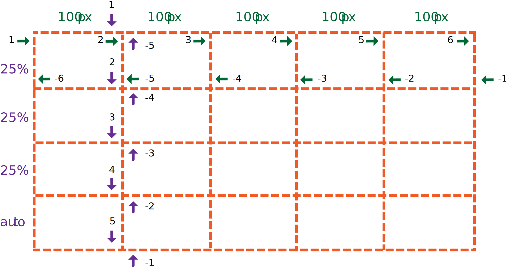
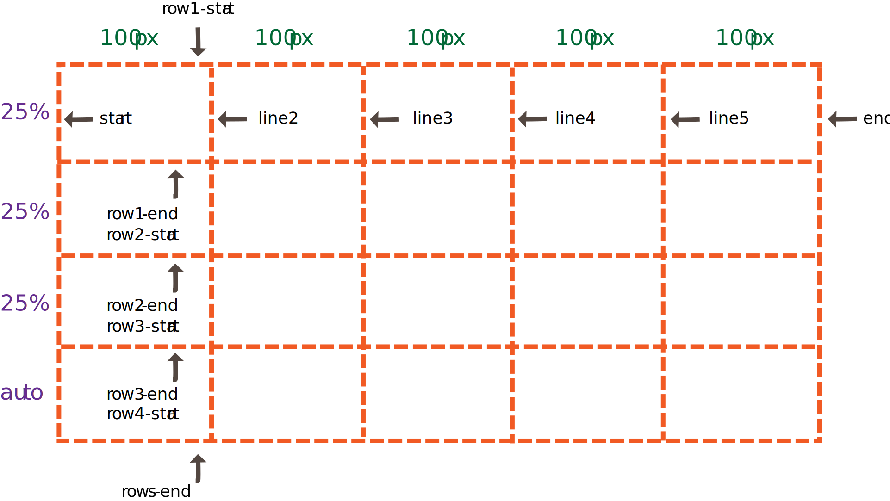
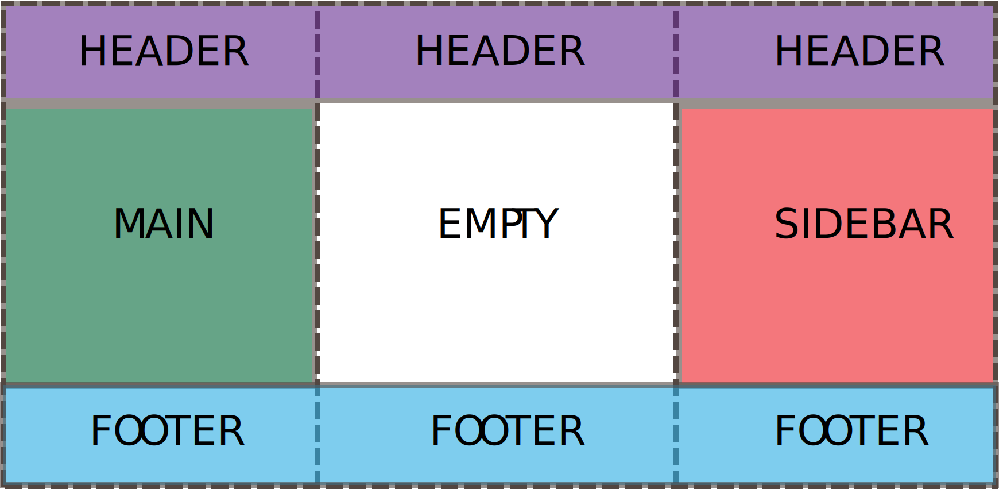
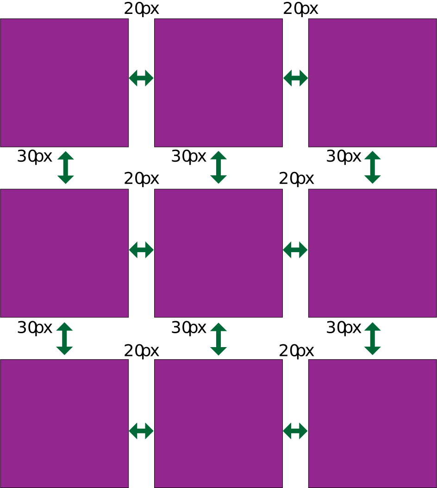
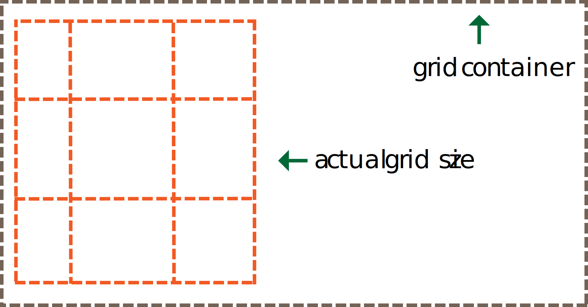

# Grid Container Styles
________________________________________________________________________________
<!-- @import "[TOC]" {cmd="toc" depthFrom=2 depthTo=6 orderedList=false} -->

<!-- code_chunk_output -->

- [Columns and Rows](#columns-and-rows)
- [Repeating Columns and Rows](#repeating-columns-and-rows)
- [Fractions](#fractions)
- [Grid Template Areas](#grid-template-areas)
- [Grid Gaps](#grid-gaps)
- [Justify/Align Items](#justifyalign-items)
- [Justify/Align Content](#justifyalign-content)
- [Implicit Grids and Auto Rows/Columns/Flow](#implicit-grids-and-auto-rowscolumnsflow)
- [Shorthand Container Properties](#shorthand-container-properties)
- [What we learned:](#what-we-learned)

<!-- /code_chunk_output -->
________________________________________________________________________________

A grid layout consists of CSS styles applied to:

* A grid container (parent element)
* Grid items (children elements)

In this reading, we're covering all the styles related to the grid container.
To set a parent element to be a grid container, we simply need to apply
`display: grid` to a CSS class selector, like so:

```css
.grid-container {
  display: grid;  /* OR inline-grid */
}
```

## Columns and Rows

We can set the number of columns and rows in a grid, as well as their track
sizes, by using the `grid-template-rows` and `grid-template-columns` properties.

```css
.grid-container {
  grid-template-columns: <track-size> ... | <line-name> <track-size> ...;
  grid-template-rows: <track-size> ... | <line-name> <track-size> ...;
}
```

The `<track-size>` refers to the size of either the rows or columns. It can be
pixels, a percentage, a fraction of space left (using `fr`), or set to `auto`
(which expands or shrinks depending on the items within it).

Grid lines mark the start/end of rows and columns. You can call a `<line-name>`
anything you choose (and also give a line multiple names), or you can leave it
blank, which defaults to positive or negative numbers.

Here’s an example 5x4 grid with unnamed/default grid lines. Each space between
the sizes in `grid-template-columns` and `grid-template-rows` represents a line
number (1, 2, 3, 4, etc.):

```css
.grid-container {
  display: grid;
  grid-template-columns: 100px 100px 100px 100px 100px;
  grid-template-rows: 25% 25% 25% auto;
}
```



Here’s an example 5x4 grid with named grid lines:

```css
.grid-container {
  grid-template-columns: [start] 100px [line2] 100px [line3] 100px [line4] 100px [line5] 100px [end];
  grid-template-rows: [row1-start] 25% [row1-end row2-start] 25% [row2-end row3-start] 25% [row3-end row4-start] auto [rows-end];
}
```



## Repeating Columns and Rows

You can easily repeat columns and rows of the same size. Let’s refactor our
first example above using `repeat()`:

```css
.grid-container {
  display: grid;
  grid-template-columns: repeat(5, 100px [col-start]);
  grid-template-rows: repeat(4, 25% [row-start]);
}
```

Just like in the first example, the grid will be five columns of 100px each.
We’ve named each grid line separating the columns `col-start`. The grid will
also have four columns of 25% each, and the grid lines separating rows are
named `row-start`.

## Fractions

We’ve used percentages, pixels and `auto` for the track size so far, but we
could also use fractions. The `fr` unit specifies the fraction of available
space to be filled up by a row or column. The following two examples are
equivalent, and each example will create a grid with four rows that each take
up one-quarter of the available space.

```css
.grid-container {
  display: grid;
  grid-template-rows: repeat(1fr 1fr 1fr 1fr);
}
```

```css
.grid-container {
  display: grid;
  grid-template-rows: repeat(25% 25% 25% 25%);
}
```

If we wanted to, we could create any combination of percentages, pixels or
fractions, like the following:

```css
.grid-container {
  display: grid;
  grid-template-columns: repeat(12% 200px auto 400px);
  grid-template-rows: repeat(50px 2fr 2fr 1fr);
}
```

The `fr` units are flexibly calculated after all other exact measurements (like
percentages or pixels). Again, `auto` will expand or shrink based on what’s
contained within that column or row.

## Grid Template Areas

CSS Grid gives us a handy way to map out and visualize areas of the grid
layout. We can combine the grid container property `grid-template-areas` with
the grid items property `grid-areas` to define areas of a template and how much
space they should take. Let’s look at an example:

```css
.item-1 {
  grid-area: header;
}
.item-2 {
  grid-area: main;
}
.item-3 {
  grid-area: sidebar;
}
.item-4 {
  grid-area: footer;
}
.grid-container {
  display: grid;
  grid-template-columns: repeat(3, 1fr);
  grid-template-rows: auto;
  grid-template-areas: 
    "header header header"
    "main . sidebar"
    "footer footer footer";
}
```



In this example, we’ve created a 3x3 grid. The `header` area takes up the
entire first row / all three columns across. In the second row, the first
column is filled by `main` area, the second column is blank (represented by a
period), and the third column is filled by the `sidebar` area. We used the `fr`
unit for the columns, so they should flexibly fill the available space, and the
rows will `auto` resize to fit their items.

## Grid Gaps

Grid gaps refer to the spaces between rows or between columns. They are
basically “gutters”. These properties allow us to set the spacing between rows
or columns:

* `grid-column-gap` - accepts a size value
* `grid-row-gap` - accepts a size value

```css
.grid-container {
  ...
  grid-column-gap: 20px;
  grid-row-gap: 30px;
}
```



We could also use the shorthand property `grid-gap` to include both
`grid-column-gap` and `grid-row-gap`. The first value is the `grid-row-gap` and
the second value is the `grid-column-gap`.

```css
.grid-container {
  ...
  grid-gap: 30px 20px;
  /* <grid-row-gap> | <grid-column-gap>. */
}
```

## Justify/Align Items

We can position items inside their respective rows or columns. These container
properties can be used to set the alignment of all items within a grid
container:

* `justify-items` - aligns items on the row (horizontally)
    - start - aligns items with the start line of their cell (left side)
    - end - aligns items with the end line of their cell (right side)
    - center - aligns items in the center of their cell (center)
    - stretch - fills the whole width of the cell (the default value)

* `align-items` - aligns items on the column (vertically)
    - start - aligns items with the start line of their cell (top of cell)
    - end - aligns items with the end line of their cell (bottom of cell)
    - center - aligns items in the center of their cell (center)
    - stretch - fills the whole height of the cell (the default value)

```css
.grid-container {
  justify-items: stretch;  /* OR start | end | center */
  align-items: stretch;  /* OR start | end | center */
}
```

## Justify/Align Content

In some instances, like when grid items are sized with non-flexible units like
pixels, your grid might be smaller than its container and there is extra space.
In that case, you might want to set the position of the grid inside its
container.



These container properties can be used to set the alignment of the
entire grid inside its container:

* `justify-content` - aligns items on the row (horizontally)
    - start - aligns the grid with the start of the grid container (left side)
    - end - aligns the grid with the end of the grid container (right side)
    - center - aligns the grid in the center of the grid container (center)
    - stretch - resizes the grid items so that the grid fills the **full width**
of the grid container
    - space-around - equal spaces between grid items, with half-sized spaces at
the start / end
    - space-between - equal spaces between grid items, with no space at the
      start / end
    - space-evenly - equal spaces between grid items, including at the start / end

* `align-content` - aligns items on the column (vertically)
    - start - aligns the grid with the start of the grid container (top of
container)
    - end - aligns the grid with the end of the grid container (bottom of container)
    - center - aligns the grid in the center of the grid container (center)
    - stretch - resizes the grid items so that the grid fills the **full
      height** of the grid container
    - space-around - equal spaces between grid items, with half-sized spaces at
the start / end
    - space-between - equal spaces between grid items, with no space at the
      start / end
    - space-evenly - equal spaces between grid items, including at the start / end

```css
.grid-container {
  justify-content: stretch;  
    /* start | end | center | space-around | space-between | space-evenly */
  align-content: stretch;  
    /* start | end | center | space-around | space-between | space-evenly */
}
```

## Implicit Grids and Auto Rows/Columns/Flow

Up until now, we have set properties for an _**explicit grid**_. Using the
properties `grid-template-rows`, `grid-template-columns` and/or
`grid-template-areas`, we have _explicity_ set the number of rows and columns
in the grid.

However, sometimes an _**implicit grid**_ gets created. This happens when there
are more grid items than cells in the grid, or when a grid item is placed
outside of the explicit grid (we’ll talk more about placing grid items in the
next section). The grid container automatically adds new lines to the grid,
creating implicit grid tracks. The explicit grid plus these implicit grid
tracks create an implicit grid.  

(_See this CSS-Tricks doc on [The Difference Between Explicit and Implicit
Grids][1] for more info._)

We can specify the size of any auto-generated grid tracks (i.e. implicit grid
tracks) using these properties:

* `grid-auto-columns` - accepts a track-size value (a length, % or `fr`)
* `grid-auto-rows` - accepts a track-size value (a length, % or `fr`)

You might want to set the auto-generated tracks the be the same size as your
explicit rows and columns. For example, if you had a grid with columns that are
100px and rows that are 50px, then you will most likely want to use those
values for the auto-generated tracks.

```css
.grid-container {
  display: grid;
  grid-template-columns: 100px 100px 100px 100px;
  grid-template-rows: 50px 50px 50px;
  grid-auto-columns: 100px;
  grid-auto-rows: 50px;
}
```

Any grid items that aren’t explicitly placed on the grid are automatically
placed, or _re-flowed_. We can set the flow of grid items on implicit grid
tracks by using:

* `grid-auto-flow` - accepts any of the following placement values
    - row - fills in each row in order, adding new rows as necessary (the
      default value)
    - column - fills in each column in order, adding new columns as necessary
    - dense - fills in spaces earlier in the grid if smaller items come up later
(beware: might make grid items appear out of order)

## Shorthand Container Properties

We can combine grid container properties by using shorthand properties. However,
you may want to familiarize yourself with the properties we discussed above
before using these.

* `grid-template` - shorthand property for `grid-template-rows`,
`grid-template-columns` and `grid-template-areas`
* `grid-gap` - shorthand property for `grid-column-gap` and `grid-row-gap`
* `place-items` - shorthand property for `justify-items` and `align-items`
* `place-content` - shorthand property for `justify-content` and `align-content`
* `grid` - shorthand property for `grid-template`, `grid-auto-columns`,
`grid-auto-rows` and `grid-auto-flow` (you can create the entire grid with this
one property)

_Check out the MDN doc on [CSS Grid Layout][2] for a full list of grid container
properties, their definitions and examples._

## What we learned:

* Setting up a basic grid with columns and rows
* Easily repeating columns and rows
* Using the `fr` unit for fractions
* Setting up a whole grid with `grid-template-areas` and `grid-area`
* Creating grid gaps between columns and rows
* Setting the alignment of an item in its cell
* Setting the alignment of a grid inside its container
* What happens when an implicit grid is created
* Shorthand properties that combine container properties

[1]: https://css-tricks.com/difference-explicit-implicit-grids/
[2]: https://developer.mozilla.org/en-US/docs/Web/CSS/CSS_Grid_Layout