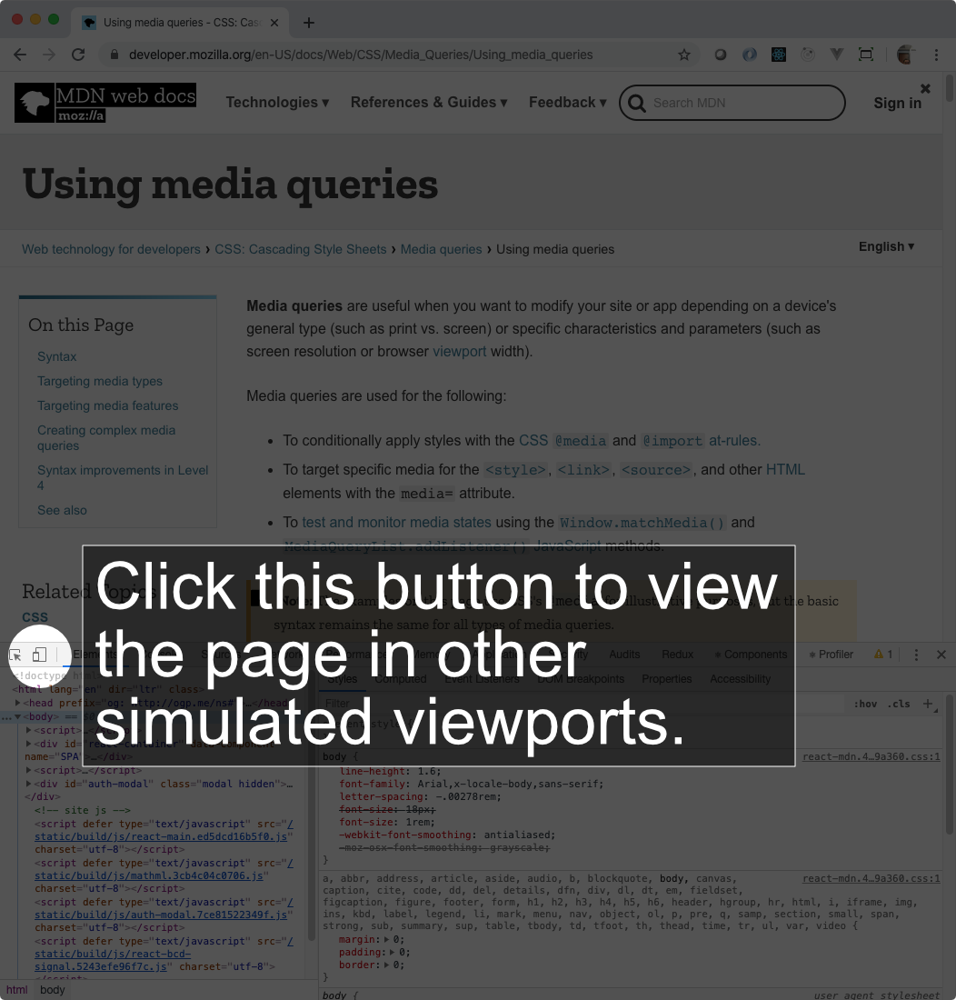
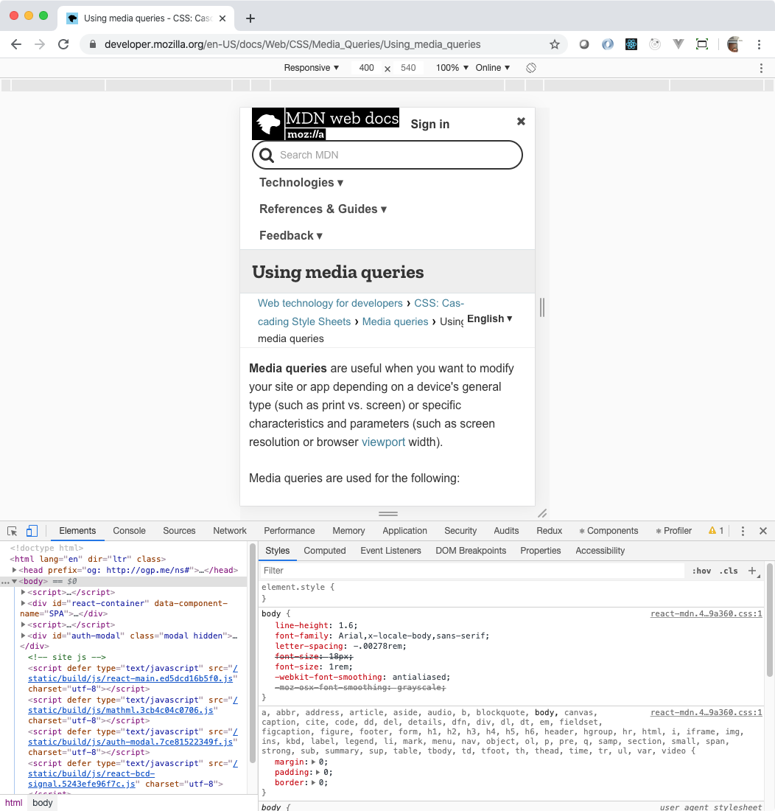

# CSS Media Queries
________________________________________________________________________________
<!-- @import "[TOC]" {cmd="toc" depthFrom=2 depthTo=6 orderedList=false} -->

<!-- code_chunk_output -->

- [What is a "viewport"?](#what-is-a-viewport)
- [An example media query](#an-example-media-query)
- [Media types](#media-types)
- [Media features](#media-features)
- [Combining queries with logical operators](#combining-queries-with-logical-operators)
- [What you learned](#what-you-learned)

<!-- /code_chunk_output -->
________________________________________________________________________________

Responsive design ensures that we are designing and developing to be inclusive
of different platforms, devices, screen widths and orientations. A key part of
responsive design is the use of [_media queries_][1], which allow us to set
media conditions for styles.

In this reading, we’ll go over how to use media queries to develop for different
device types and screen widths. We’ll review how to set up a media query,
different media types, media features, and how to combine types and features.

## What is a "viewport"?

The _viewport_ is the area in which the _user agent_ is rendering the content of
the HTML with the CSS applied to it. This normally means the _window of the
browser_. However, both Chrome and Firefox have a way to view your Web content
without manually resizing the window. In the Developer tools, there is a
Responsive Design tool that lets you view the content in differently-sized
_viewports_ that are not the same size as your browser window.

To try this out, open this link in another tab in Chrome.

https://developer.mozilla.org/en-US/docs/Web/CSS/Media_Queries/Using_media_queries

Now, open the Developer tools for that page.

We could also use the browser Developer Tools to view a website on different
devices. Both Chrome and Firefox have a Responsive Design tool that lets you
view the site in different device viewports (look for the icon that looks like a
phone/tablet).



Once you do that, the screen will emulate a different screen size. In the
following screen capture, you can see the viewport has changed to a width of
400 pixels and a height of 540 pixels. Because MDN has media queries in its CSS,
the layout of header navigation, sections, and table of contents completely
changes.



To exit the Responsive Design tool, just click the button in the Developer
Tools, again, or close the Developer Tools pane.

## An example media query

Let’s jump right into an example media query:

```css
/* In an example.css file */
@media screen and (min-width: 768px) {
  /* styles for this breakpoint go here */
}
```

In CSS, you use `@media` to start the definition of a media query. You then can
specify the specific type of medium you want to target, in this case, the CSS
targets the screen. You follow that with some kind of condition, in this case it
will apply the rules inside the media query when the browser window has a
minimum width of 768 pixels. The different types of conditions fall into
categories named _media features_, in this case, the "width" feature. Each media
query's conditions define what is called a _breakpoint_, or the point at which a
website responds to a media query and applies its styles.

## Media types

You can target media queries by _media type_ or _media feature_, or a
combination of the two.

Media types refer to the general category of the type of device that the media
query targets. There are three distinct types, and one

* "all" refers to all devices which is the default for a media query when the
  type is not provided
* "print" applies to the layout of the document when a person intends to print
  it
* "screen" applies to the layout of the document when a browser displays it
* "speech" refers to when a screen reader reads the content

Typically developers use "screen" option when specifying a specific media type.
However, quite often, developers omit it and just rely on the default "all"
setting. The following CSS customizes the font sizes for "print" and "screen"
display using "points" for the printing and "pixels" for the screen.

```css
html {
  font-family: 'Roboto', 'Arial', sans-serif;
}

@media print {
  html {
    font-size: 12pt;
  }
}

@media screen {
  html {
    font-size: 14px;
  }
}
```

## Media features

_Media features_ refer to the characteristics of a browser, other output device,
or rendering environment. You will most often use the following features to
change the display of your pages based on how a person is viewing the content.

| Feature      | Applies to                                   | Subfeature prefixes |
|--------------|----------------------------------------------|---------------------|
| aspect ratio | The ratio of width to height of the viewport | max- and min-       |
| height       | The height of the viewport                   | max- and min-       |
| orientation  | If width is larger than height or vice versa |                     |
| width        | The width of the viewport                    | max- and min-       |

**Please note** that the "orientation" feature for media queries _does not_
refer to the actual orientation of the device!

The following CSS changes the size of the font depending on the width of the
viewport, adjusting it for very large screen and small screens. It also changes
the layout of the content between "row" and "column" based on the whether the
screen is "portrait" or "landscape".

```css
body {
  font-size: 14px;
  display: flex;
}

@media (min-width: 1600px) {
  body {
    font-size: 18px;
  }
}

@media (max-width: 360px) {
  body {
    font-size: 10px;
  }
}

@media (orientation: landscape) {
  flex-direction: row;
}

@media (orientation: portrait) {
  flex-direction: column;
}
```

**Please note** that all of the prefixed versions of the features are
_inclusive_. That means that `min-width: 300px` means that the user agent will
test that the width of the viewport is _greater than or equal to_ 300 pixels.

Refer to the MDN doc on [Using media queries][1] for a list of all the supported
media features.

## Combining queries with logical operators

Media queries allow you to create Boolean expressions using AND and OR
operators. One would think that they would provide the keywords `and` and `or`
to do that. Alas, they did not.

Say you wanted to target a specific width of screen greater than 300 pixels and
less than or equal to 600 pixels. Say you wanted to swap the background and text
colors for screens between those two sizes. You could do it with the `and`
keyword like this.

```css
html {
  background-color: white;
  color: #333333;
}

@media (min-width: 301px) and (max-width: 600px) {
  html {
    background-color: #333333;
    color: white;
  }
}
```

To do the same thing, but with an OR, you just use a comma. To CSS, it really
means two different rules, but that's the same as an OR. In this case, the
default page has the dark background with the light text. Then, when the
viewport's width is less than or equal to 300 pixels _or_ greater than or equal
to 601 pixels, it makes the background light and the text dark. Same effect,
different Boolean operator.

```css
html {
  background-color: #333333;
  color: white;
}

@media (max-width: 300px), (min-width: 601px) {
  html {
    background-color: white;
    color: #333333;
  }
}
```

You can also use the `not` operator to create a negative condition for a media
query. This is a way to do really fancy customizations. Unfortunately, the
current implementation of CSS in most browsers, CSS Level 3, you can only use
the `not` operator to negate an entire media query. That kinds of sucks. Someone
somewhere must use it, though. This following snippet negates the condition
where for all monochrome devices, which just means devices that can display
color.

```css
@media not (all and (monochrome)) {
  body {
    background-color: magenta;
  }
}
```

Check out CSS-tricks’ list of [Media Queries for Standard Devices][2] for an
extensive list of breakpoints for different devices.


## What you learned

- Why you use media queries for responsive design
- How to construct a media query by type and feature
- How to combine media queries
- How to test different device viewports in the browser

[1]: https://developer.mozilla.org/en-US/docs/Web/CSS/Media_Queries/Using_media_queries
[2]: https://css-tricks.com/snippets/css/media-queries-for-standard-devices/
