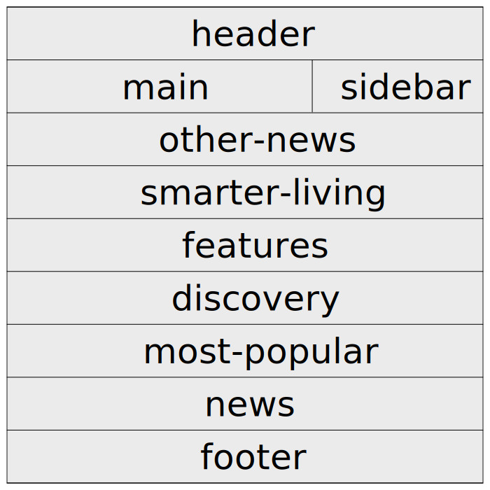

# Gridding Up A Page: Phase One

________________________________________________________________________________

Based on the large screenshot from before, you will need to set up a grid with
10 sections, i.e. “areas”, which you’ll can refer to these labels in order of
appearance.

* **header** (Section 1)
* **main** (Section 2)
* **sidebar** (Section 3)
* **other-news** (Section 4)
* **smarter-living** (Section 5)
* **features** (Section 6)
* **discovery** (Section 7)
* **most-popular** (Section 8)
* **news** (Section 9)
* **footer** (Section 10)

The grid that you want to set up will have this layout



Recall that you can set up grid areas by using the `grid-template-areas` and
`grid-area` properties. Now that we've set up the grid areas, let's add
`grid-template-areas` to the `grid__container` class.

```css
/* Main Grid Styles */

.grid__container {
  display: grid;
  grid-template-columns: /* Make the first column 2x wide as the second. */ ;
  grid-template-rows: auto;
  grid-template-areas:
    /* Fill in the appropriate grid areas here. */ ;
}

.grid__section {
  border: 1px solid #333333;
}

.grid__section-1 {
  grid-area: /* Fill this in. */ ;
}

.grid__section-2 {
  grid-area: /* Fill this in. */ ;
}

.grid__section-3 {
  grid-area: /* Fill this in. */ ;
}

.grid__section-4 {
  grid-area: /* Fill this in. */ ;
}

.grid__section-5 {
  grid-area: /* Fill this in. */ ;
}

.grid__section-6 {
  grid-area: /* Fill this in. */ ;
}

.grid__section-7 {
  grid-area: /* Fill this in. */ ;
}

.grid__section-8 {
  grid-area: /* Fill this in. */ ;
}

.grid__section-9 {
  grid-area: /* Fill this in. */ ;
}

.grid__section-10 {
  grid-area: /* Fill this in. */ ;
}
```
