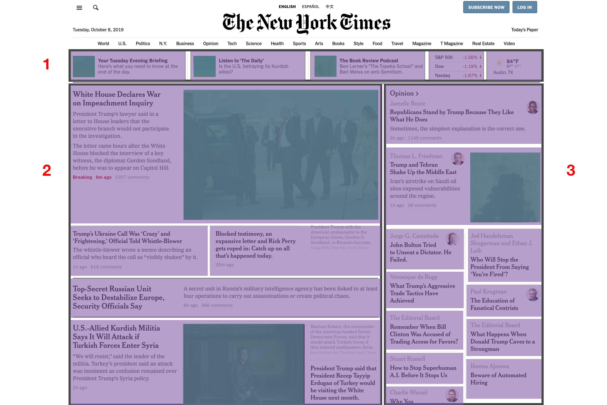

# Gridding Up A Page: Phase Two

________________________________________________________________________________

Did you know that you can combine CSS Grid with flexbox? Take a look at the
`header` (Section 1) in the grid. The items in that section appear as a row,
making it a good candidate for a one-dimensional flexbox container. We recommend
right-clicking the following image and viewing it in a new tab to take a closer
look.



In your HTML file, you can find an element with the class name
`flex-container-1` in the `grid__section-1` DIV, as well as five children
`flex-items`.

```html
<div class="grid grid__container">
  <div class="grid__section grid__section-1 flex-container-1">
    <div class="flex__item flex__item-1">Flex 1</div>
    <div class="flex__item flex__item-2">Flex 2</div>
    <div class="flex__item flex__item-3">Flex 3</div>
    <div class="flex__item flex__item-4">Flex 4</div>
    <div class="flex__item flex__item-5">Flex 5</div>
  </div>
  ...
</div>
```

In your CSS file, style the div with the class `flex-container-1` so that it’s
an actual flex container and give it a height of `85px`. Style each `flex__item`
so that they appear inline. You want all five `flex__item` elements to fit into
a single row. To do that, you can use the `flex-grow` setting to set the
relative sizes so that they do that. The first three flex items,
`.flex__item-1`, `.flex__item-2`, and `.flex__item-3`, should be twice as
wide as the last two flex items, `.flex__item-4` and `.flex__item-5`.

```css
.flex-container-1 {
  display: /* Fill this in. */ ;
  height: 85px;
}

.flex__item {
  display: /* Fill this in. */ ;
  height: inherit;
}

.flex__item-1,
.flex__item-2,
.flex__item-3 {
  flex-grow: /* Fill this in to be twice as wide as the others */;
}

.flex__item-4,
.flex__item-5 {
  flex-grow: /* Fill this in to be half as wide as the others */;
}
```
