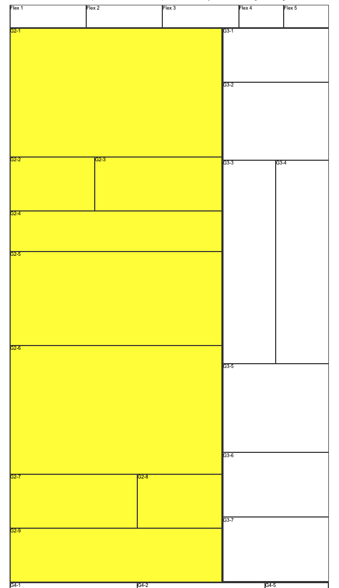
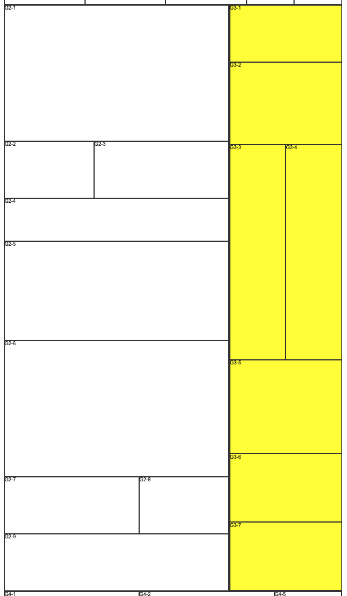

# Gridding Up A Page: Phase Three

________________________________________________________________________________
<!-- @import "[TOC]" {cmd="toc" depthFrom=1 depthTo=6 orderedList=false} -->

<!-- code_chunk_output -->

- [Gridding Up A Page: Phase Three](#gridding-up-a-page-phase-three)
  - [Section 2](#section-2)
  - [Section 3](#section-3)

<!-- /code_chunk_output -->
________________________________________________________________________________

Just like we can nest flexbox containers, we can also nest grid containers. Any
grid item can itself become a grid container with `display: grid`. You're going
to use this fact to layout the **main** and the **sidebar** areas of the HTML.

## Section 2

Make the **main** area (Section 2) of the grid a grid container. Make each one of
the nine items in the **main** area its own grid area.

We've added nine items in the `grid__section-2` DIV in your HTML file:

```html
<div class="grid grid__container">
  ...
  <div class="grid__section grid__section-2">
    <div class="grid__item grid__item-2-1">G2-1</div>
    <div class="grid__item grid__item-2-2">G2-2</div>
    <div class="grid__item grid__item-2-3">G2-3</div>
    <div class="grid__item grid__item-2-4">G2-4</div>
    <div class="grid__item grid__item-2-5">G2-5</div>
    <div class="grid__item grid__item-2-6">G2-6</div>
    <div class="grid__item grid__item-2-7">G2-7</div>
    <div class="grid__item grid__item-2-8">G2-8</div>
    <div class="grid__item grid__item-2-9">G2-9</div>
  </div>
  ...
</div>
```

You're going to make them look like this.



Set up the grid areas in your CSS file using the following naming convention.
Make sure to set up all nine of them.

```css
.grid__item-2-1 {
  grid-area: g2-1;
}

.grid__item-2-2 {
  grid-area: g2-2;
}

.grid__item-2-3 {
  grid-area: g2-3;
}

/* Set up the rest of the nine grid items. */
```

Set up your grid container for `grid__section-2` with _**five columns and seven
rows**_. This might be a good place to play with fractions by using the `fr`
unit.

Each grid item takes up a full row with a couple of exceptions: `grid__item-2`
shares a row with `grid__item-3`, and `grid__item-7` shares a row with
`grid__item-8`.

Create five columns of equal width. Set up `grid__item-2` and `grid__item-8` to
take up 2 / 5 of their row, and set up `grid__item-3` and `grid__item-7` to take
up the remaining 3 / 5 of the row.

```css
.grid__section-2 {
  display:  /* Fill this in. */ ;
  grid-template-columns: /* Make five columns of equal widths. */ ;
  grid-template-rows: /* Fill this in. */ ;
  grid-template-areas:
   /* Fill in the appropriate grid areas here. */ ;
}
```

There should be seven rows in your new grid. You may want to add background
colors to these so they are easier to see on the page.

Add heights to the grid items so that they approximate the heights on the NYT
homepage seen in the screenshots. Use these heights:

| Element           | Height     |
|-------------------|------------|
| `.grid__item-2-1` | 480 pixels |
| `.grid__item-2-2` | 200 pixels |
| `.grid__item-2-3` | 200 pixels |
| `.grid__item-2-4` | 150 pixels |
| `.grid__item-2-5` | 350 pixels |
| `.grid__item-2-6` | 480 pixels |
| `.grid__item-2-7` | 200 pixels |
| `.grid__item-2-8` | 200 pixels |
| `.grid__item-2-9` | 200 pixels |

At this point, add some border lines to help you see where the grid items start
and end.

```css
.flex__item,
.grid__item {
  border: 1px solid #333333;
}
```

## Section 3

Now, it's time to handle the **sidebar**. There are also seven items in the
`grid__section-3` DIV in your HTML file:

```html
<div class="grid__section grid__section-3">
  <div class="grid__item grid__item-3-1">G3-1</div>
  <div class="grid__item grid__item-3-2">G3-2</div>
  <div class="grid__item grid__item-3-3">G3-3</div>
  <div class="grid__item grid__item-3-4">G3-4</div>
  <div class="grid__item grid__item-3-5">G3-5</div>
  <div class="grid__item grid__item-3-6">G3-6</div>
  <div class="grid__item grid__item-3-7">G3-7</div>
</div>
```

You're going to make them look like this.



Repeat the same process used above for `grid__section-2` to create another grid
inside `grid__section-3`. In the following grid, create two columns of equal
width. `.grid__item-3-3` will share a row with `.grid__item-3-4` and have equal
heights, while the other five grid items will take up one row each.

```css
/* Grid Section 3 Styles */

.grid__item-3-1 {
  grid-area: g3-1;
}

.grid__item-3-2 {
  grid-area: g3-2;
}

.grid__item-3-3 {
  grid-area: g3-3;
}

/* Set up the rest of the seven grid items. */

.grid__section-3 {
  display:  /* Fill this in. */ ;
  grid-template-columns: /* Make two columns of equal widths. */ ;
  grid-template-rows: /* Fill this in. */ ;
  grid-template-areas:
   /* Fill in the appropriate grid areas here. */ ;
}
```

Add heights to the grid items so that they approximate the heights on the NYT
homepage seen in the screenshots. Use these heights:

| Element           | Height     |
|-------------------|------------|
| `.grid__item-3-1` | 200 pixels |
| `.grid__item-3-2` | 290 pixels |
| `.grid__item-3-3` | 760 pixels |
| `.grid__item-3-4` | 760 pixels |
| `.grid__item-3-5` | 330 pixels |
| `.grid__item-3-6` | 240 pixels |
| `.grid__item-3-7` | 240 pixels |
