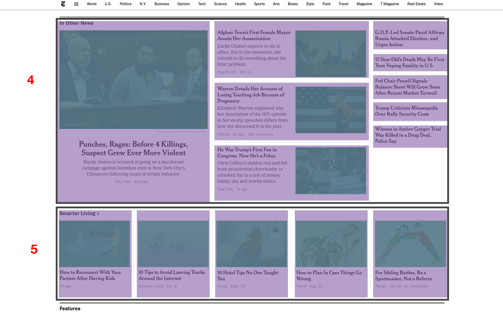
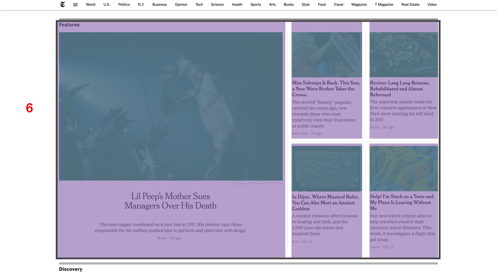
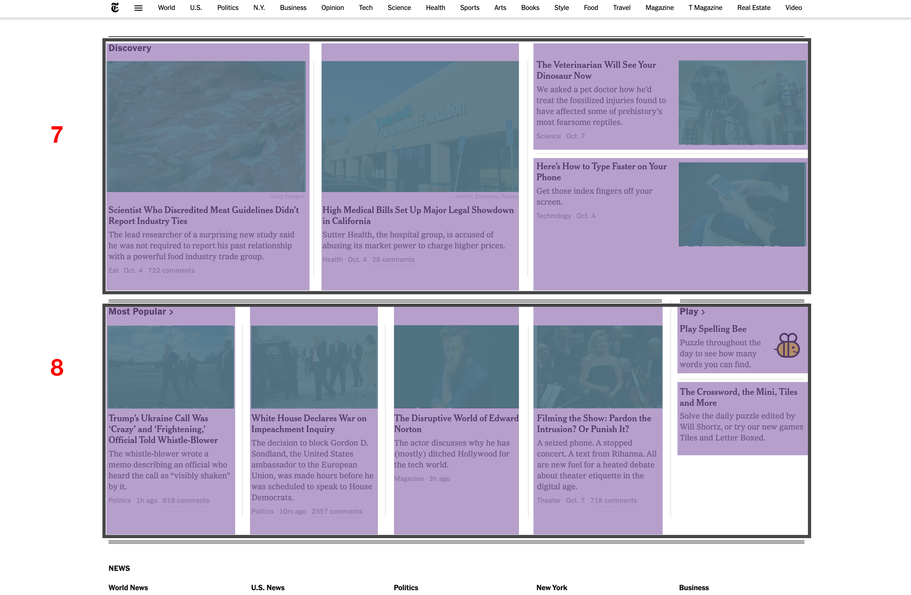
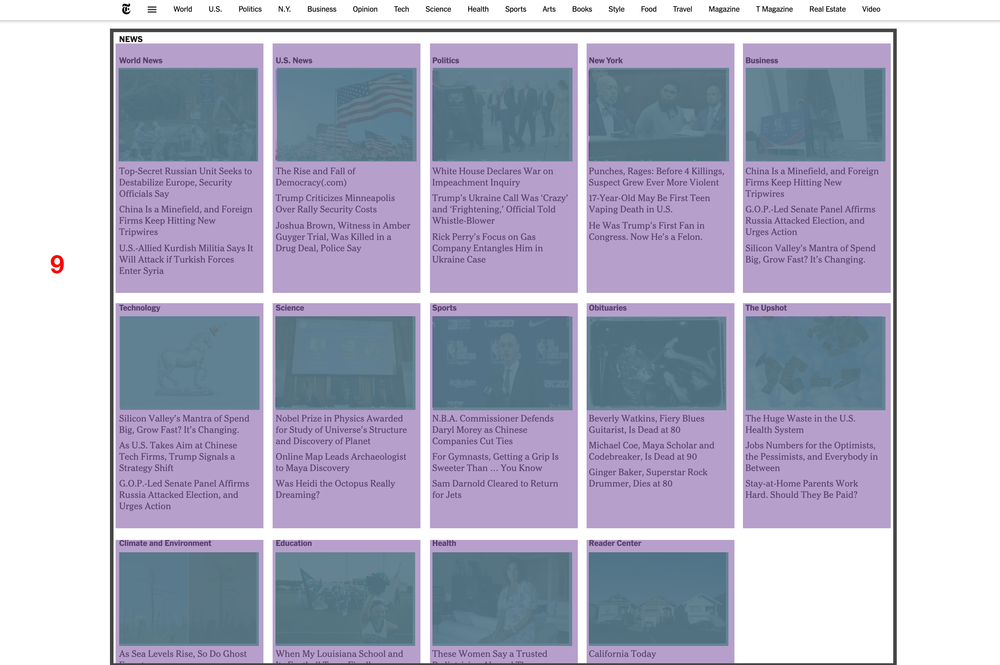
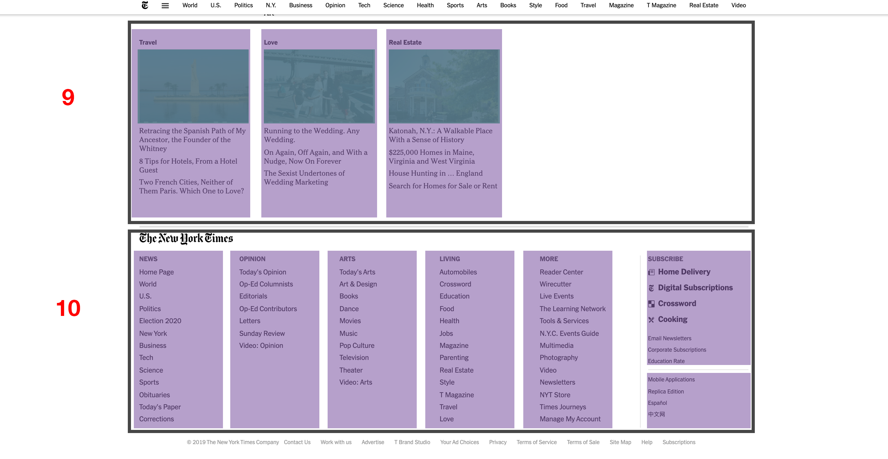

# Gridding Up A Page: Phase Four
________________________________________________________________________________
<!-- @import "[TOC]" {cmd="toc" depthFrom=2 depthTo=6 orderedList=false} -->

<!-- code_chunk_output -->

- [For Section 4 ("Other News")](#for-section-4-other-news)
- [For Section 5 ("Smarter Living")](#for-section-5-smarter-living)
- [For Section 6 ("Features")](#for-section-6-features)
- [For Section 7 ("Discovery")](#for-section-7-discovery)
- [For Section 8 ("Most Popular")](#for-section-8-most-popular)
- [For Section 9 ("News")](#for-section-9-news)
- [For Section 10 ("Footer")](#for-section-10-footer)
- [What you've done](#what-youve-done)

<!-- /code_chunk_output -->
________________________________________________________________________________

Use your knowledge of both flexbox and CSS Grid, you can finish the layout for
all 10 areas of the main grid. Each section below contains the specifications
for you to finish it. You should be pretty familiar with the content of the
HTML file, now. For each of the sections below, you will be dealing with the
CSS class `.grid__section-«number»` where «number» is 4, 5, 6, etc.

## For Section 4 ("Other News")

- Set this section's height to 590px.
- Create a grid with 5 columns of equal width and 6 rows of equal width.
- Place the 9 grid items in the correct locations (see screenshot below).

## For Section 5 ("Smarter Living")

- Set this section's height to 273px.
- Create a flex container that contains a row of items.
- Set the 5 items to be equal width so that they appear on the row, according to
  the screenshot (see screenshot below).

## For Section 6 ("Features")

- Set this section's height to 712px.
- Create a grid with 6 columns of equal width and 2 rows of equal width.
- Place the 5 grid items in the correct locations (see screenshot below).

## For Section 7 ("Discovery")

- Set this section's height to 400px.
- Create a grid with 7 columns of equal width and 2 rows of equal width.
- Place the 4 grid items in the correct locations (see screenshot below).

## For Section 8 ("Most Popular")

- Set this section's height to 360px.
- Create a grid with 5 columns of equal width and 3 rows of equal width.
- Place the 6 grid items in the correct locations (see screenshot below).

## For Section 9 ("News")

- Create a flex container that contains rows of items and allows items that
  don't fit to wrap to a new row.
- Set each one of the 17 items to have a height of 360px and width of 20%.
- The items in this section should flexibly fill their container, like in the
  screenshot below.

## For Section 10 ("Footer")

- Set this section's height to 404px.
- Create a grid with 6 columns. The first 5 columns should be equal width, and
  the last column should be 213px wide. The grid should also be 3 rows of equal
  width.
- Place the 7 grid items in the correct locations (see screenshot below).

## What you've done

You have just had a lot of practice figuring out how to make the Flexible Box
Model and Grid Layouts work. That is really a credit to you. Here's a link to
the solution file, if you want to take a look at it.
