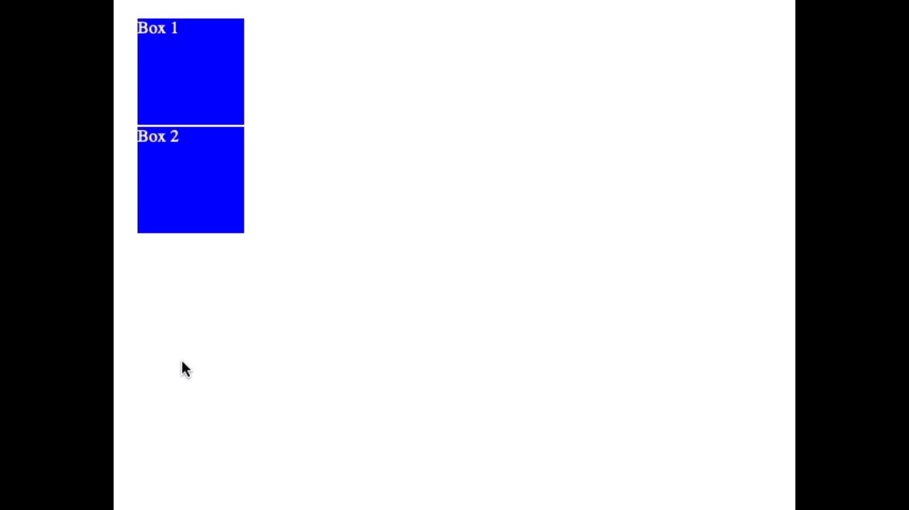

# CSS Transitions
________________________________________________________________________________
<!-- @import "[TOC]" {cmd="toc" depthFrom=2 depthTo=6 orderedList=false} -->

<!-- code_chunk_output -->

- [Defining transitions](#defining-transitions)
- [Examples](#examples)
- [What can you affect with this?](#what-can-you-affect-with-this)

<!-- /code_chunk_output -->
________________________________________________________________________________

CSS transitions provide a way to control animation speed when changing CSS
properties. Instead of having property changes take effect immediately, you can
cause the changes in a property to take place over a period of time. For
example, if you change the color of an element from white to black, usually the
change is instantaneous. With CSS transitions enabled, changes occur at time
intervals that follow an acceleration curve, all of which can be customized.

Animations that involve transitioning between two states are often called
implicit transitions as the states in between the start and final states are
implicitly defined by the browser.

CSS transitions let you decide which properties to animate (by listing them
explicitly), when the animation will start (by setting a delay), how long the
transition will last (by setting a duration), and how the transition will run
(by defining a timing function, e.g. linearly or quick at the beginning, slow at
the end).

## Defining transitions

CSS Transitions are controlled using the shorthand transition property. This is
the best way to configure transitions, as it makes it easier to avoid out of
sync parameters, which can be very frustrating to have to spend lots of time
debugging in CSS.

You can control the individual components of the transition with the following
sub-properties:

| Sub-property        | Definition                                                                                                                                                                                                                                   |
|---------------------|----------------------------------------------------------------------------------------------------------------------------------------------------------------------------------------------------------------------------------------------|
| transition-property | Specifies the name or names of the CSS properties to which transitions should be applied. Only properties listed here are animated during transitions; changes to all other properties occur instantaneously as usual.                       |
| transition-duration | Specifies the duration over which transitions should occur. You can specify a single duration that applies to all properties during the transition, or multiple values to allow each property to transition over a different period of time. |
| transition-delay    | Defines how long to wait between the time a property is changed and the transition actually begins.                                                                                                                                          |

## Examples

This example performs a four-second font size transition with a two-second delay
between the time the user mouses over the element and the beginning of the
animation effect:

```css
#delay {
  font-size: 14px;
  transition-property: font-size;
  transition-duration: 4s;
  transition-delay: 2s;
}

#delay:hover {
  font-size: 36px;
}
```

When the mouse hovers over it, after a delay of two seconds, a four-second
transition begins which changes the font size of the text from its normal size
to 36px.


In the following, any element with the "box" class will have combined transitions
for: width, height, background-color, transform.

```css
.box {
    border-style: solid;
    border-width: 1px;
    display: block;
    width: 100px;
    height: 100px;
    background-color: #0000FF;
    transition: width 2s, height 2s, background-color 2s, transform 2s;
}

.box:hover {
    background-color: #FFCCCC;
    width: 200px;
    height: 200px;
    transform: rotate(180deg);
}
```

When the mouse hovers over a box, it spins due to the rotate transform. Its
width and height change. Its background color changes.



You can interact with the hover effects controlled via CSS for both of these
demos by hovering over the text and boxes in the [Transition Examples CodePen].

[Transition Examples CodePen]: https://codepen.io/aa-academics/pen/jOPvzxb?editors=1100

## What can you affect with this?

You can't apply transitions to every CSS property there is. Here is the [list
of animatable CSS properties]. If it's not in that list, then you can't animate
it.

Glaringly absent from that list are any CSS properties that allow you to
position elements on a Web page, properties like `left` or `bottom`. The work
around is to animate the _margin_ of the element.

[list of animatable CSS properties]: https://developer.mozilla.org/en-US/docs/Web/CSS/CSS_animated_properties
