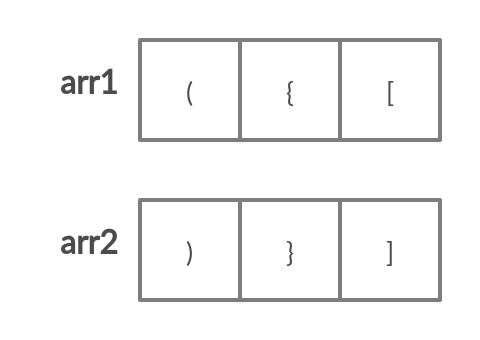
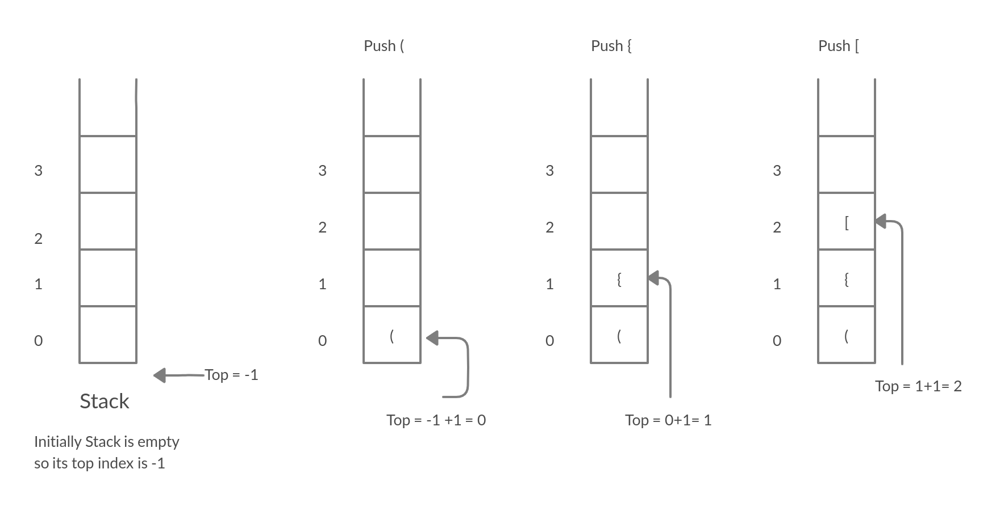
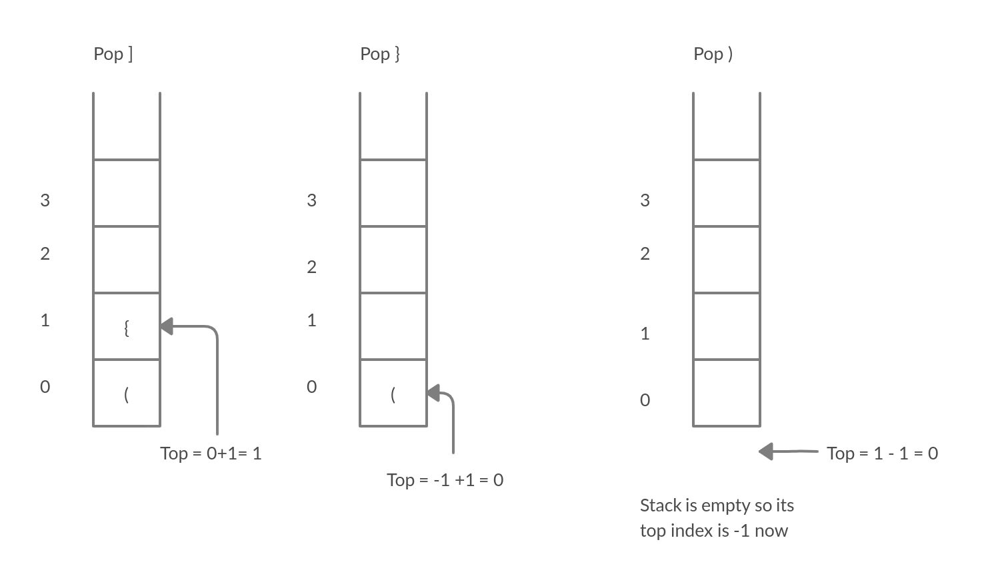

# Balanced Paranthesis
### **Introduction**

**Balancing paranthesis** is one of the classic example application of Stack. It follows a particular order
in which operations are carried out. This order of operation is popularly known as LIFO (Last In, First Out) operation.

Parenthesis or Bracket is considered to be any of the following characters: 
1. ( small opened bracket
2. ) small closed bracket
3. {  opened curly brace
4. }  closed curly brace
5. [  opened big bracket
6. ]  closed big bracket 

The task is to check whether the given string of these characters combined in any form is balanced or not.

### **Problem Description**
One will be given with a string that contains these brackets in any form like {(a+b)}, the problem is to determine whether the given string is balanced or not.

The given string is balanced if:
1. Open brackets are closed by the same type of brackets.
2. Open brackets are closed in the correct order.

        Example
            1. Input: "()"
               Output: true
   
            2. Input: "({[]})"
               Output: true
   
            3. Input: "({])"
               Output: false
               
            4. Input: "[ab*](){a+b}
               Output: true

_Note that an empty string is also considered valid._

### **Problem solving approach**
This problem is solved by implementing Stack Principle. This approach includes pushing and popping of element to and from the stack.

If the character we are reading is opening parenthesis then we push the character onto the stack and if we encounter a closing parenthesis then we check if the top element on the stack is corresponding opening parenthesis. If we find that it is the case then we pop the element from the stack. At the end, if the stack is empty, we return valid, else invalid.

The problem solving approach can be formally described by the following algorithm:

      function BalancedParenthesis(string):
         
         initialize stack object as s

         for i = 1 to lengthOfString - 1
            
            if string[i] == '(' or '{' or '['
               push string[i] onto the stack

            else if string[i] == ')' or ']' or '}'
   
                  if stack is empty: 
                     return false
                  
                  else if closing and opening are corresponding:
                     pop the top element from stack
         
         if stack is empty:
            return true
         else:
            return false
                  

At first let's define two sets of array:
        1. Array that contains opening brackets i.e ( , { and [
        2. Array that contains closing brackets i.e ) , } and ]
   

Now lets consider Example. 2 as our Input String.

        Input = "({[]})"
       
The input is read in linear fashion from start to end. Whenever character of given input string
is in array that contains only opening parenthesis, the character is pushed onto the stack. This process of pushing character into the stack continues till condition is met.

For example in our given string, '(' is the first character and since it falls arr1. It is pushed into the stack as shown in figure below:

This process continues till '[' character is read in the given string. Now next character is ']' which
doesn't fall under arr1. As this character is of another array i.e arr2 in our case, it's position in arr2 is compared with position of top indexed
character of stack in arr1 as shown below:

If the condition is matched, the top indexed item is popped out from Stack. This also decreases the count of top index of stack by 1 as shown in figure above.

In the same way, this procedure of pushing and popping is followed till the Stack becomes empty and hence the given string is said to be balanced. If in case, this procedure gets stuck in the middle because of invalid matching (which obviously doesn't make Stack empty), then the given Input string cannot be balanced.
