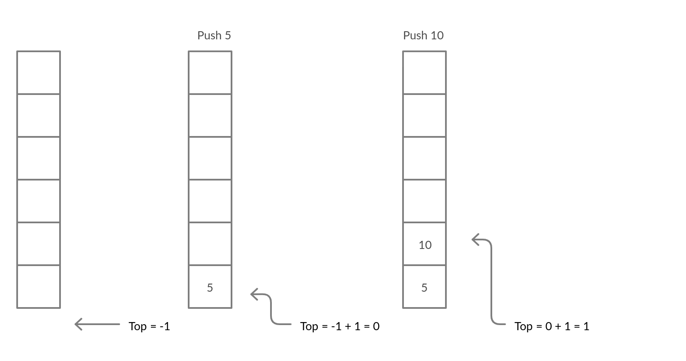
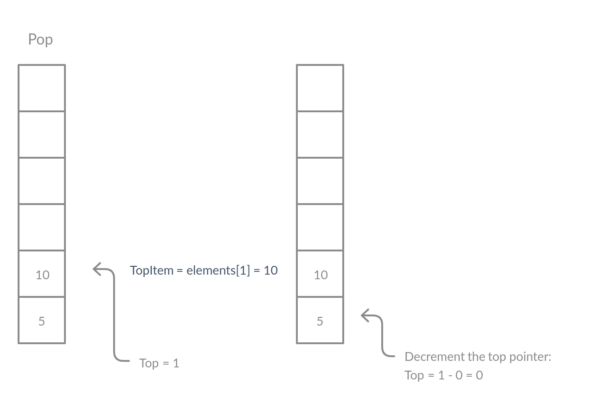

# Stacks
Stacks are Last-In-First-Out(LIFO) data structures which means any element which is inserted at the last in a stack will be taken out at the first in this data structure.

In a stack, there are 2 components: a list of elements, a variable that points to the top index at the list.

	Stack: 
		elements - array
		top - an index that points to the top of element

The following algorithm can be used to push a new element in the stack:
	
	function push(item):
		increment the top index: top = top + 1
		set elements[top] = item

This can be visualized by the following image

The following algorithm can be used to pop (remove from the top) an item from a stack:

	function pop():
		store topItem = elements[top]
		decrement the top counter by one: top = top - 1
		return topItem

This can be visualized by the following image
