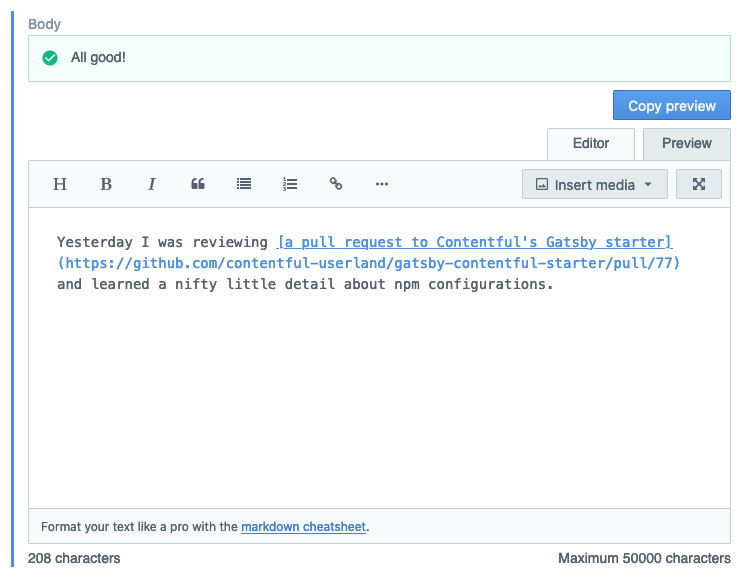
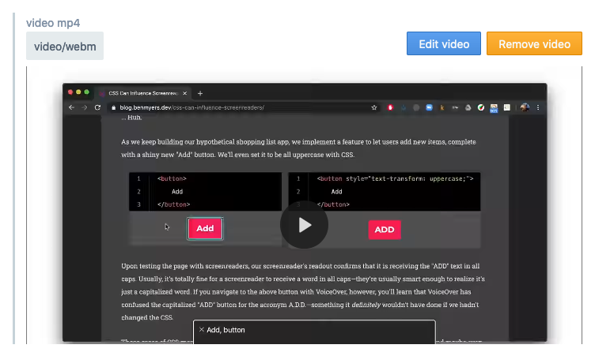

# Stefan's Contentful App playground

This App is built with [the Contentful App Framework](https://www.contentful.com/app-framework/). I treat this repository as my playground.

**Feel free to use and/or fork it for your Contentful App.**

❗If you have ideas or wishes for custom Contentful components, [please file an issue](https://github.com/stefanjudis/stefan-judis-website-editors/issues/new) and let me know about them. :)

## An enriched markdown editor

My Markdown editor includes a copy button and inclusive language checking using [Alex.js](https://alexjs.com/).

## Video reference with inline preview

Preview video assets in the linking entry.

## License

[MIT](./LICENSE)
